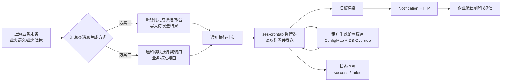
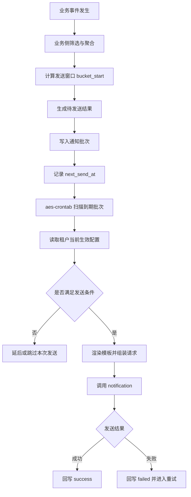
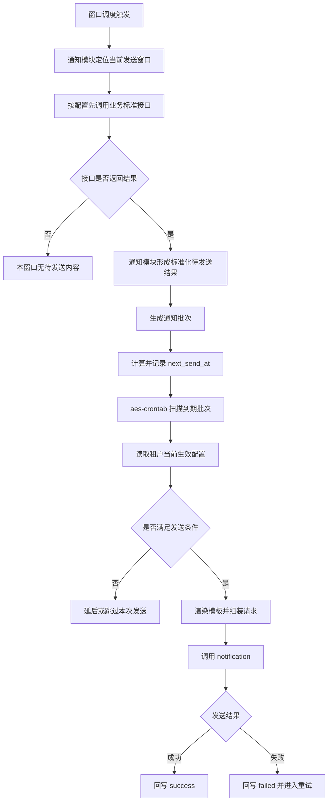

# AES 通知能力总体评审方案

## 文档说明

本文档讨论的是 AES 现有微服务体系内的通知能力建设方案。


## 背景与建设目标

当前业务需要在多种客户场景下提供稳定、统一、可配置的通知能力，例如：

- 安全事件告警通知
- 审计类结果通知
- 系统状态变更通知
- 后台汇总类通知

这类通知虽然业务来源不同，但在客户视角上有一组共同诉求：

- 能按租户生效
- 能按消息类型区分策略
- 能支持企业微信、邮件、短信等不同渠道
- 能支持实时通知和汇总通知两类典型场景
- 能做到配置统一、行为稳定、故障可观测

如果缺少一层统一的通知执行机制，系统通常会出现以下问题：

- 不同业务各自实现发送逻辑，协议和行为难以统一
- 通知渠道、模板、接收对象和发送治理规则分散在多个服务中，后续维护成本高
- 同类通知在不同租户、不同场景下缺少一致的配置模型
- 失败重试、幂等、监控和排障能力无法统一建设
- 新增通知场景时需要重复开发，整体交付效率低

因此，本次建设的目标是在 AES 现有微服务体系内补齐一套统一的通知能力模块，用于支撑客户在多种业务场景下的通知能力建设。

本方案希望达成以下目标：

- 统一收口通知发送能力
- 统一配置通知执行策略
- 统一承载发送、限流、重试、幂等等执行逻辑
- 支撑实时类和汇总类两类典型通知场景
- 复用现有XDR的通知通道
- 保持链路轻量、可解释

本文档聚焦 AES 内通知能力模块本身的建设内容，包括配置、批次、执行、状态和观测。

## 方案范围

### 本次纳入范围

- 消息推送规则配置管理
- 汇总类消息生成方式设计
- 待发送结果承接与发送治理
- AES 内通知能力模块维护通知执行配置的默认值和租户覆盖
- AES 内通知能力模块执行器扫描批次、渲染模板、调用 `notification`
- AES 内通知能力模块维护最小必要的发送状态、幂等和可观测性

### 当前待评审的前置决策

汇总类消息如何生成，当前有两种待评审路径：

- 方案一：业务侧完成筛选与聚合后，将待发送结果交由通知模块发送
- 方案二：通知模块按配置周期调用业务接口获取标准化结果，再执行发送治理

本文后续设计会在统一通知能力框架下展开，并结合该决策点做方案对比与取舍。

## 总体设计

从整体设计上看，AES 通知能力模块的作用不是替代各业务服务去做业务计算，而是在现有微服务体系内补齐一层统一的通知配置、通知执行和通知治理能力。

在这套设计下：

- 上游业务服务负责提供业务语义、业务数据来源以及本域判断能力
- AES 通知能力模块负责统一配置、统一发送执行和统一状态治理
- 汇总类消息究竟由业务侧产出结果，还是由通知模块按周期拉取业务接口，属于本次待评审的关键决策
- 底座继续承接具体渠道发送

### 总体链路图



### 逻辑分层

整体链路分为四层：

- 上游业务层
- AES 通知配置与编排层
- AES 通知执行层
- `notification` 发送底座

### 分层职责

#### 上游业务层

负责：

- 定义消息类型对应的业务语义
- 提供本业务域的数据来源和判定能力
- 在方案一中负责筛选、聚合、汇总并写入待发送结果
- 在方案二中负责提供标准化查询接口，并返回约定结构

配合方式：

- 方案一中按统一协议写入通知批次
- 方案二中按统一协议暴露查询接口
- 透出本业务域的消息语义和结构化结果

#### AES 通知配置与编排层

负责：

- 维护通知执行域配置
- 计算租户最终生效配置
- 管理模板 code、渠道、接收对象等执行配置
- 提供统一配置读取与生效视图
- 提供模板和相关配置的管理入口

#### AES 通知执行层

负责：

- 扫描待发送批次
- 按租户当前生效配置执行发送
- 模板渲染
- 并发控制、限流、失败回写
- 幂等透传和有限重试

#### Notification 底座

负责：

- 统一承接 AES 通知能力模块的发送请求
- 通过幂等机制处理重复发送
- 下发企业微信、邮件、短信等具体渠道

两条链路不在这里重复展开，放到后文“汇总类消息生成方式对比”里统一说明。

## 核心设计

### 触发边界

先把边界定清楚：

- 上游业务负责“业务上发生了什么、哪些数据可被查询、什么结果有业务意义”
- 通知模块负责“这些结果按什么配置发送、通过什么渠道发送、如何做发送治理”

通知模块不直接承担业务真值判断。

过滤边界先作为待拍板项列出：

- 如果采用方案一，则业务侧天然承担主要的筛选与聚合，通知模块以发送治理为主
- 如果采用方案二，则通知模块可以承接统一配置入口和周期调度，但业务侧仍需通过标准化接口返回可被消费的结构化结果

无论采用哪种方案，通知模块都至少会承接以下执行类配置：

- 是否开启该 `msg_type`
- 采用什么渠道
- 采用什么模板
- 采用什么发送频率
- 接收对象等执行配置

`severity`、资产范围以及更复杂筛选条件是否纳入通知模块配置域，需要在本次评审中单独拍板。

### 实时筛选承接方式

实时类消息一旦引入 `severity`、资产范围、任务状态等筛选条件，真正需要明确的不只是“这些字段是否出现在配置里”，而是“这些筛选条件按什么事实模型执行”。

这里有两种方案：

#### 方案 A：业务侧执行筛选，通知模块只承接结果

做法：

- 通知模块保存筛选配置
- 业务侧按 `tenant + msg_type` 维度本地缓存当前生效配置
- 业务事件发生时，业务侧优先使用本地缓存的生效配置
- 配置缓存通过 TTL 或主动刷新机制更新，不在实时链路中逐条回查通知模块
- 业务侧按本域语义判断是否命中筛选条件
- 命中后产出标准化待发送结果，交给通知模块发送

特点：

- 业务真值判断完全留在业务侧
- 通知模块边界更轻
- 多个业务服务都要各自实现筛选执行逻辑

#### 方案 B：先转标准化事实模型，再由通知模块统一筛选

做法：

- 业务事件先转换为通知模块约定的标准化事实模型
- 通知模块基于标准化事实模型执行统一筛选
- 命中后进入后续发送治理链路
- 标准化事实模型不做成一个覆盖所有消息类型的超大模型，而是保留极小公共头，再按告警类、任务类、巡检类、审计类拆分各自事实子模型
- 一条消息只落入自己对应的事实子模型，通知模块不直接面向各业务服务的原始结构做筛选

例如：

- 原始安全告警对象可能很大，但进入通知模块前，不是拍平成一堆杂乱字段，而是转换成一个统一外层结构，加上按事实分组的子结构
- 例如统一外层先保留公共头：
  - `tenant_id = 1001`
  - `msg_type = security_alert`
  - `occurred_at = 2025-04-22T10:00:00`
- 再挂接对应的事实子结构，例如 `alert_fact`：
  - `severity = high`
  - `event_type = ioc_hit`
  - `asset_group_id = 2001`
  - `rule_id = xxx`
- 如果是任务类消息，就不是填 `alert_fact`，而是填 `task_fact`
- 通知模块筛选时，不直接理解原始业务对象，而是只认这层“公共头 + 对应事实子结构”
- 例如安全告警类消息只针对 `alert_fact` 里的字段做筛选：
  - `severity in [high, critical]`
  - `asset_group_id in [2001, 2002]`
- 命中后再进入发送链路

理由：

- 筛选逻辑可以收敛在通知模块，配置和执行路径更统一
- 对告警类、任务类这类字段相对稳定的消息，更容易形成统一筛选能力
- 后续前端配置、校验和筛选字段展示更容易对齐

### 配置模型

通知执行配置采用“默认值 + 租户覆盖”的双层模型：

- 默认配置放共享 `ConfigMap`
- 租户覆盖配置放 `OceanBase`
- 对外 `GET` 返回最终生效配置
- 对外 `PUT` 只写租户覆盖值

本次先纳入配置域的字段：

- `enabled`
- `channels`
- `receivers`
- `template_code`

配置域先聚焦通知执行相关字段，不展开业务侧任务编排字段。

如果评审最终决定由通知模块承接一部分筛选条件，就单独补充标准化的 `filter_rule` / `query_body` 扩展字段，不在当前稿里默认已经支持复杂筛选。

### 配置动态生效

配置动态生效可直接按下面处理：

1. 执行时已经明确 `tenant_id` 和 `message_type`
2. 先读取该租户该消息类型的数据库配置
3. 如果数据库中没有对应配置，则回退读取默认配置
4. 为减少频繁读取，对生效配置结果做本地 TTL 缓存，例如 `3m`
5. TTL 过期后重新读取并刷新缓存

这里的规则很简单：

- 数据库配置优先
- 默认配置兜底
- 读取频率通过本地 TTL 控制

运行期只需要维护租户维度的生效配置缓存：

- `tenant_id + message_type -> effective_config`

其中 `effective_config` 由默认配置和租户覆盖合并得出，执行链路真正消费的是“当前租户当前消息类型的最终生效配置”。

这样处理有几个直接的好处：

- 贴近当前被调用时已明确租户的执行方式
- 模型更轻，不需要维护全量租户快照
- 执行器只关心当前请求对应的最终配置
- 默认值和租户覆盖的合并逻辑仍然保留在配置层内部

### 频率控制与发送时机

频率属于通知发送策略，但“汇总结果在谁那里生成”取决于前置决策。

无论采用哪种方案，都按固定时间窗口来设计，而不是按单条消息逐条延迟：

- `REALTIME`：实时触发发送
- `10m`：归入当前 10 分钟窗口
- `1h`：归入当前 1 小时窗口
- `1d`：归入当天约定汇总窗口

两种方案下的处理差异如下：

- 方案一：业务侧完成筛选/聚合后，直接写入某个窗口对应的待发送结果，通知模块只按 `next_send_at` 扫描并发送
- 方案二：通知模块按窗口周期调用业务接口，业务接口返回当前窗口对应的标准化结果，通知模块再形成待发送批次并发送

为降低评审理解成本，这里直接给出两张流程图，分别对应 `方案一` 与 `方案二` 的完整处理链路。

#### 方案一流程图



#### 方案二流程图



因此，这一层统一需要保留的最小时间语义是：

- 当前结果属于哪个发送窗口
- 该窗口何时允许发送

实现上可通过 `bucket_start` 与 `next_send_at` 表达，也可等价编码进幂等键和调度参数中；暂不强制显式拆出独立字段。

### 批次模型

按执行特性拆两张批次表：

- `aes_notify_realtime_batch`
- `aes_notify_schedule_batch`

拆分原因：

- 响应式通知强调低延迟
- 后台任务强调吞吐和稳定
- 两类任务混用一张表，即使增加 `priority` 也很难真正实现资源隔离

每条批次至少保留以下事实字段：

- `tenant_id`
- `message_type`
- `payload_snapshot`
- `idempotent_key`
- `status`
- `retry_count`
- `last_error`
- `next_send_at`
- `created_at`
- `updated_at`

对于汇总型任务，时间窗口信息可以直接编码进 `idempotent_key`，例如：

```text
{biz}:{messageType}:{tenantId}:{windowStart}:{windowEnd}
```

例如：

```text
security-alert-summary:weekly:tenant-1:2026-04-01T00:00:00+08:00:2026-04-07T23:59:59+08:00
```

这样可以直接用 `idempotent_key` 同时表达：

- 这是哪一类业务通知
- 属于哪个租户
- 覆盖哪个时间窗口

在这个前提下，批次表可以先不额外新增 `window_start/window_end` 字段，先保持字段模型更轻。

### 冻结参数原则

从业务效果上看，消息最终发送出来的结果应与发送当时的当前配置保持一致。

因此，待发送批次入库时不直接冻结以下通知策略参数：

- 渠道
- 模板
- 接收对象
- 频率策略

待发送批次入库时只保留业务事实和发送时机相关信息，具体字段以“批次模型”和“频率控制与发送时机”两节为准。

执行器在真实发送前，再读取当前租户生效配置，确定本次发送使用的：

- 渠道
- 模板
- 接收对象

规则如下：

- 尚未发送的待发送记录，按发送当时的当前配置执行
- 已经进入实际发送过程的记录，以本次发送快照为准

### 执行模型

执行逻辑由 `aes-crontab` 统一承载：

- 一个执行器服务
- 两个扫描器
- 两个 worker pool
- 一个共享 `notification client`

执行节奏：

- 响应式通道：高频扫描、小批量抓取、独立并发池
- 后台通道：相对低频扫描、大批量抓取、独立并发池

执行器部署方式：

- 多实例部署
- 同一时刻仅一个活跃实例负责定时扫描、批次调度和发送执行
- 其他实例作为备实例存在，在主实例故障或退出时接管
- 通过分布式锁控制主执行实例选举与切换
- 第一版不做更细粒度的分表、分通道锁拆分

服务落点的结论如下：

- 通知执行能力直接复用 `aes-crontab` 承载，不额外新增通知执行微服务
- 控制面服务负责通知配置、模板和相关管理接口

理由：

- 通知能力本质上就是持续运行的后台执行服务，和 `aes-crontab` 的服务形态一致
- 直接复用现有后台执行服务，可以降低部署、运维、监控和发布成本
- 先把通知能力闭环做完整，再谈是否拆细服务边界

后续如果出现以下情况，再评估从 `aes-crontab` 中拆分独立通知执行服务：

- 通知执行需要独立扩缩容
- 通知链路吞吐和资源消耗明显增长
- 需要独立 SLA、独立发布节奏或独立故障域

### 状态设计

状态模型应遵循最小化原则，优先只保留关键事实。

首选目标状态：

- `pending`
- `success`
- `failed`

不引入额外的 `sending` 等中间态，数据库状态只表达最终需要保留的关键事实。

原则是：

- 数据库存状态用于支撑补偿、观测和排障
- 执行中的过程控制尽量在执行器内部完成
- 不把数据库状态设计成完整执行过程的镜像

### 幂等设计

幂等 key 按通知类型拆两类：

#### 定时/汇总型

按固定时间窗口幂等，基础格式如下：

```text
sched:{messageType}:{tenantId}:{windowStart}:{windowEnd}
```

#### 响应式

按具体业务事件幂等，基础格式如下：

```text
rt:{messageType}:{tenantId}:{eventId}
```

若业务侧没有稳定 `eventId`，则退化为：

```text
rt:{messageType}:{tenantId}:{bizId}:{eventSemantic}
```

幂等设计要求：

- 重跑不换 key
- 重试不换 key
- 延迟发送不换 key
- key 体现业务语义，而不是当前执行时间

如果评审最终要求幂等粒度下沉到渠道或配置生效维度，则在基础格式后补充 `channel`、`configId` 等字段。

### 与 Notification 的接口边界

继续复用 `notification HTTP`，把精力集中在 AES 内通知能力的收口和治理上。

AES 通知能力模块侧需要统一一个轻量 `notification client`，负责：

- HTTP 请求封装
- 超时、错误处理
- 日志和指标标准化
- 幂等 key 透传

`notification` 的返回契约需要明确区分成功、普通失败和限流/容量保护三类结果，尤其要能完整返回限流状态，例如：

- 是否命中下游限流
- 限流维度，例如通道级、租户级或全局级
- 建议退避时长或下次可重试时间
- 稳定错误码和可观测错误信息

AES 执行器识别到限流状态后，应将其视为容量保护信号，而不是普通发送失败信号。处理方式如下：

- 本轮发送及时退出，不继续向 `notification` 施压
- 按返回的退避信息延后下一次尝试
- 在日志、指标和告警中单独归类为限流事件

AES 通知能力模块不应把 HTTP 细节散落到各执行逻辑中。

## 数据模型

### 租户覆盖配置表

统一使用一张租户覆盖表承接 `PUT` 写入，例如：

- `aes_notify_strategy_override`

字段如下：
- `tenant_id`：租户标识
- `message_type`：消息类型标识
- `enabled_override`：是否启用的租户覆盖值
- `channels_override_json`：渠道覆盖值，例如企业微信、邮件、短信
- `receivers_override_json`：接收对象覆盖值，例如管理员、指定联系人组
- `template_code_override_json`：模板 code 覆盖值，直接表达该租户该消息类型使用哪个模板 code
- `ext_json`：预留扩展字段。如果后续评审决定承接 `filter_rule` 或 `query_body`，可在定版后替换为明确字段
- `created_at / updated_at`：记录创建和更新时间

唯一键：

- `(tenant_id, message_type)`

### 批次表

批次表分两张：

- `aes_notify_realtime_batch`
- `aes_notify_schedule_batch`

两张表保持一致的核心字段语义，降低执行器复用成本。

### 模板管理

模板相关能力拆成两部分看：

- 模板 code 配置，属于通知配置的一部分
- 模板内容本体，属于通知模块统一管理的内容资产

模板部分口径如下：

- 每个模板定义唯一 `template_code`
- 执行时直接根据配置中的 `template_code` 取模板
- 模板内容不下沉到业务微服务各自维护
- 模板内容先采用统一文件方式集中维护，并挂载到 `aes-crontab` 执行侧使用

这里直接明确：

- `aes-crontab` 负责加载和使用模板
- `aes-crontab` 不负责模板管理入口
- 模板维护职责仍然属于通知模块控制面

### 模板边界约束

模板设计遵循一个原则：模板按消息语义收敛，不按数值差异裂变。

- 同一类通知不因为数值区间、阈值差异或展示精度差异拆成多份模板
- 模板负责文案骨架和占位渲染，不负责复杂业务判断
- 数值格式化、单位换算、等级判断和摘要结论应在模板外完成

例如，不建议因为 CPU 使用率不同拆成：

- `cpu_80_template`
- `cpu_90_template`
- `cpu_overload_template`

更合理的方式是收敛为一个语义稳定的模板，例如：

- `cpu_alert_template`

执行时由上游或渲染前处理层提供结构化变量，例如：

- `cpu_usage`
- `threshold`
- `level`
- `summary_text`

模板层只负责展示最终变量，避免把数值判断和展示规则持续下沉到模板内部。

这样做更稳：

- 避免因数字展示差异导致模板数量持续膨胀
- 数值规则调整时不需要同步改动多套模板
- 国际化场景下模板数量更容易控制
- 模板职责更稳定，长期维护成本更低

### 国际化设计

国际化能力和模板管理一起设计，先采用文件化模板方式落地，不额外引入复杂模板中心。

这里直接定一个口径：通知模板不直接复用现有通用 `i18n` 资源模型，但 `locale` 规范、默认语言和回退规则与现有 `i18n` 保持兼容。

原因很实际。现有 `i18n` 更适合管理界面文案、按钮文案、提示语这类短文本资源；通知模板承载的是完整消息内容，通常同时包含：

- 渠道差异，例如企业微信、邮件、短信的内容结构不同
- 变量注入，例如用户名、时间、指标值、阈值、摘要结论
- 内容块差异，例如标题、正文、列表、附加说明

如果把通知模板硬拆成现有 `i18n` 的 key-value 形式，实际维护中会很快出现以下问题：

- 一条通知会被拆成大量零散 key，结构不直观
- 渠道差异和变量占位混在一起，渲染逻辑会外溢到代码中
- 模板预览、版本管理和排查都会变复杂

例如，一个 CPU 巡检告警邮件，如果直接按现有 `i18n` 去做，可能会被拆成：

```text
notify.cpu_alert.title
notify.cpu_alert.greeting
notify.cpu_alert.metric_label
notify.cpu_alert.threshold_label
notify.cpu_alert.level_label
notify.cpu_alert.summary_prefix
notify.cpu_alert.footer
```

这样做的问题是，正文结构、变量注入顺序和邮件专属段落都很难自然表达，最后还是要在渲染代码里重新拼装，模板边界也会被打散。

更合理的方式是保留一份完整模板，例如 `cpu_alert_email_zh-CN`，在模板中只引用已经准备好的结构化变量，由执行器按 `template_code + channel + locale` 定位并渲染。

国际化模板按 `template_code + channel + locale` 组织：
- 模板文件或目录命名直接采用 `template_code_channel_locale`

例如：

```text
security_alert_wechat_zh-CN
security_alert_wechat_en-US
security_alert_email_zh-CN
security_alert_email_en-US
```

`locale` 直接使用完整标识，例如：

- `zh-CN`
- `en-US`

执行时按以下维度定位模板：

- `template_code`
- `channel`
- `locale`

这样处理更顺手：

- 目录结构直观，便于维护和排查
- 实现简单，不需要额外模板中心
- 既能保留完整模板结构，又能和现有 `i18n` 在语言规范上保持一致
- 后续如果模板数量增长，也可以平滑迁移到 DB 或模板中心方案

## 可靠性与可观测性

### 可靠性目标

可靠性设计遵循：

- 整体通知链路按 at-least-once 设计
- AES 内通知能力模块接受有限重复发送
- `notification` 负责最终幂等兜底

这是一条更务实的链路设计：

- 不依赖复杂分布式事务
- 不强求进程内外完全一次
- 通过稳定幂等键实现“重复可接受、结果可收敛”

### 失败处理

处理策略：

- 发送失败后回写 `failed`
- 针对 `failed` 做有限次补发
- 重试次数、间隔和封顶值配置化

这里补充一个收敛口径：主状态不再细分过多，只保留：

- `pending`
- `success`
- `failed`
- `terminal_failed`

同时补两个辅助维度，用来表达失败发生在哪个阶段、属于哪类错误：

- `stage`：取值收敛为 `query` / `send`
- `error_type`：取值收敛为 `timeout` / `http_5xx` / `rate_limited` / `protocol_error` / `empty_result` 等有限枚举

这样设计的目的不是做复杂状态机，而是确保“查询失败”和“发送失败”可以被稳定区分，便于后续重试、排障和指标统计。

#### 典型异常场景补充

1. 实时场景下，`notification` 持续调用失败

- 实时入口不在业务调用链内做无限重试
- 进入通知模块后先形成待发送记录或待发送批次，主状态记为 `pending`
- 调用 `notification` 失败后回写 `failed`，同时记录 `stage=send`
- 执行器按退避策略更新 `next_send_at` 并做有限补发
- 超过最大重试次数后转 `terminal_failed`

这里的核心约束是：实时失败补偿通过通知模块内的持久化状态和异步补发完成，而不是依赖调用方原地兜底。

2. 聚合场景下，通知模块按周期调用业务接口失败

- 该类失败单独归类为查询阶段失败，主状态回写 `failed`，并记录 `stage=query`
- 查询超时、HTTP 5xx、返回结构不兼容、反序列化失败，都按查询失败处理
- 查询失败时不生成发送批次，也不进入发送重试
- 下一轮只重试查询动作，不重复推进发送阶段
- 超过最大查询重试次数后转 `terminal_failed`

这里需要特别区分“查询失败”和“空结果”：

- 空结果是正常业务结论，可记录 `success` 或单独记录无数据执行结果，但不能算失败
- 查询失败是系统异常，不能被吞成“本窗口无数据”

3. 聚合场景下，业务接口调用成功，但后续调用 `notification` 失败

- 业务接口一旦成功返回，通知模块先把当前窗口对应的待发送结果固化下来
- 后续调用 `notification` 失败时，主状态回写 `failed`，并记录 `stage=send`
- 后续补发只针对已经固化的待发送结果进行，不重新调用业务接口
- 重试过程中幂等 key 保持不变，避免一次发送失败演变成重新取数
- 超过最大重试次数后转 `terminal_failed`

聚合场景要把“取数失败”和“发送失败”拆开治理。否则发送失败就回头重查业务接口

对于 `notification` 明确返回的限流场景，再补一条约束：

- 限流态不按普通失败处理，不做同一轮内的连续重试
- 执行器根据下游返回的退避信息调整 `next_send_at`
- 限流事件需要单独打指标，便于区分“下游容量保护”与“真实发送异常”


### 指标

至少落以下指标：

- `pending_batch_count`
- `failed_batch_count`
- `oldest_pending_age`
- 按 `message_type` 维度成功率
- 按 `channel` 维度成功率
- 执行器扫描耗时
- `notification` 调用耗时和错误率

### 日志与排障

这里明确区分两类信息：

- 数据库里保留批次事实和最终状态
- 应用日志里输出发送过程和错误细节

应用日志采用结构化日志，至少带上以下字段：

- `tenant_id`
- `message_type`
- `batch_id`
- `idempotent_key`
- `channel`
- `template_code`
- `status`
- `error_code`
- `error_msg`

发送失败时直接输出一条错误日志，格式上至少要做到：

- 能直接看出是哪一个租户、哪一类消息、哪一条批次发送失败
- 能直接定位本次使用的渠道、模板和幂等 key
- 能直接看到下游返回的错误码和错误信息

## 方案对比与取舍

### 通知能力落点对比

方案一：
- 各业务服务各自直接调用 `notification`

方案二：
- 各业务服务负责形成通知请求，由通知模块统一承接配置、执行和治理

结论：
- 采用方案二

理由：
- 方案一接入快，但上游很快就会感知下游发送配置，协议、模板、重试、限流、排障也会一起散出去
- 方案二把配置和治理统一收口在通知模块里，上游不用感知下游发送细节，能力也更容易做稳

### 发送链路实现方式对比

方案一：
- 直接复用现有 `notification HTTP`

方案二：
- 同时引入新的 MQ 通知链路

结论：
- 采用方案一

理由：
- 当前 `notification HTTP` 是现成且更成熟的能力，直接复用，建设面更可控
- MQ 方案当前并不是直接可用能力，如果要走 MQ，底座侧本身也需要继续开发
- 现阶段引入 MQ 带来的缓冲收益并不明显，反而会扩大实现范围和联动成本

### 待发送承接链路对比

方案一：
- 上游通过二方库直接写 `OceanBase` 待发送批次表或 `outbox` 表
- `aes-crontab` 直接扫描 `OceanBase` 并完成抢占、发送和回写

优点：

- 链路最短，待发送事实和执行状态都集中在 `OceanBase`，排障路径清晰
- 不需要额外引入“搬运任务 -> MQ -> 消费端”这一段中间链路，第一版更容易落地
- 对当前通知能力最关心的幂等、失败补发、固定窗口聚合、执行观测等诉求已经足够支撑
- 可以在通知模块入口统一做 `1s` 微批聚合，按时间或条数阈值批量写入，先拿到一部分削峰和降写收益

缺点：

- 数据库同时承担待发送事实表和执行状态表角色，吞吐上限和削峰能力不如成熟 MQ
- 实时性取决于执行器扫描频率，而不是消息到达即刻触发

方案二：
- 上游通过二方库直接写 `MQ`
- `MQ consumer` 消费后直接调用发送链路

优点：

- 事件到达后即可进入消费链路，实时性和削峰能力更强
- 更适合高并发场景下按 consumer 能力横向扩展
- 业务入口和发送执行天然解耦，不需要执行器持续扫表

缺点：

- 对固定窗口汇总、定时触发、失败补偿这类场景，仍需要额外持久化状态，不能只靠 `MQ` 本身完成
- 排障时需要同时检查业务投递、`MQ` 积压和消费执行状态，问题定位链路会更长
- 在当前前提下，新的 `MQ` 通知入口并不是现成能力，联动和建设成本更高

结论：
- 采用方案一

理由：

- 现阶段更适合把 `OceanBase` 作为统一待处理事实源，由 `aes-crontab` 直接承接扫描和执行
- 对当前通知模块强调的固定窗口聚合、有限重试、发送观测和统一治理来说，基于 `OceanBase` 的待发送事实表更容易稳定落地
- 写入压力不必一上来就切到 MQ，可以先在通知模块入口统一做 `1s` 微批，把高频小写放大先收掉一层
- 如果后面确实出现高吞吐、强削峰、强异步解耦诉求，再单独评估往 `MQ` 入口演进

### OceanBase 批次表清理机制

如果采用 `OceanBase` 作为待发送事实源，必须同步把历史数据清理机制定下来，而不是默认批次表长期累积。

清理原则：

- 热数据和历史数据分开处理
- 活跃数据面向扫描、抢占、回写，历史数据面向淘汰清理
- 清理优先走分区淘汰，不走长事务批量 `DELETE`

推荐做法：

- 批次表按“租户维度 + 时间维度”分区
- `success`、`failed` 结果只保留有限时长，例如 `7d`、`15d` 或 `30d`
- 超过保留期的数据由后台清理任务在低峰时段按分区定期删除

这里要特别考虑 `OceanBase` 的特性：

- 删除老数据不建议长期依赖按行清理，否则容易形成额外写放大和后台合并压力
- 更适合通过删除历史分区的方式做批量淘汰
- 分区删除后空间释放依赖后台合并任务，不应把“删分区”理解成“空间立刻线性回收”

因此，方案一的完整形态应理解为：

- 通知模块统一入口可做 `1s` 微批聚合
- 热数据写入当前活跃分区
- `aes-crontab` 负责扫描、发送、回写
- 独立清理任务按保留周期删除历史分区

如果后续评审担心 `OceanBase` 数据量增长，重点不在“表会不会一直变大”，而在：

- 分区粒度是否合适
- 保留周期是否清晰
- 历史分区删除是否自动化
- 清理后后台合并和空间回收是否有观测

### OceanBase 写放大控制

在 `MQ` 和 `OceanBase` 的承接链路对比拍板之后，再看写放大问题会更顺。

如果结论是先走 `OceanBase`，第一版不用把写放大当成首要矛盾。`OceanBase` 在 LSM 模型下，批次插入和结果更新本身可接受，重点还是表结构和写入方式先定对。

第一版建议直接这样落：

- 批次表主键使用自增 `id`
- 表结构同时兼顾活跃扫描与历史清理
- 不把业务字段拼进主键
- 不为了少几次写入，额外拆复杂中间表

这里先抓住两个点：

- 主键自增，保证主表写入简单直接
- 表设计要给后续历史淘汰留出口，避免长期依赖大批量按行删除

如果后面写入压力上来，优先处理顺序建议是：

1. 先在通知模块入口统一做 `1s` 微批聚合。
2. 再优化批次表分区、索引和扫描方式。
3. 最后再评估是否有必要把入口切到 `MQ`。

### 批次表模型对比

方案一：
- 单表 + `priority`

方案二：
- 响应式表和后台汇总表拆分

结论：
- 采用方案二

理由：
- 方案一表达优先级更方便，但执行资源还是容易互相影响
- 方案二更容易做执行隔离和容量治理

### 配置存储方式对比

方案一：
- 所有租户配置全量入库

方案二：
- 默认配置放 `ConfigMap`，租户差异配置放 DB override

结论：
- 采用方案二

理由：
- 方案一模型直观，但默认配置维护成本更高
- 方案二更适合“默认一致、少量租户差异”的场景

### 运行期配置读取方式对比

方案一：
- 每次执行都实时查配置源

方案二：
- 按租户按需获取并做本地短期缓存

结论：
- 采用方案二

理由：
- 方案一语义直观，但执行链路更长
- 方案二更贴近当前调用模型，也更容易控制读取成本

### 发送实现方式对比

方案一：
- 业务侧通过二方库 `sender` 直接发送

优点：

- 接入路径最短，业务服务调用后即可直接触达下游通道
- 对单条即时消息场景实现简单，初期改造成本看起来较低
- 不需要额外引入待发送批次承接和后台调度链路

缺点：

- 通知会退化为业务调用过程中的即时副作用，难以稳定承接频率控制、固定窗口聚合、失败补偿、削峰保护和统一状态治理等平台级能力
- 配置虽然可以集中，但真正的发送决策和通道调用仍分散在各业务服务中，通知模块难以真正承接统一治理职责
- 后续模板、国际化、多通道扩展、状态追踪和下游保护等能力都会持续外溢到业务侧，统一治理架构难以成立

方案二：
- 第一段负责承接并存储待发送批次
- 第二段负责按策略调度和发送

优点：

- 业务调用与下游发送解耦，通知模块可以稳定承接频率控制、发送调度、失败补发、状态追踪和通道治理
- 频率窗口、固定时间归桶、统一重试、多通道扩展等能力都能在通知模块内闭环实现
- 在该架构下，`aes-crontab` 作为持续后台执行器、租户级统一配置以及统一通知治理职责都能保持一致

缺点：

- 相比直接 `sender` 发送，需要引入待发送批次承接和后台执行链路，实现复杂度更高
- 需要维护批次表、执行状态和调度扫描机制，系统组件更多
- 前期设计和落地成本高于简单直发模式

结论：
- 采用方案二

理由：

- 这里不是再包一层发送工具库，而是要在 AES 现有微服务体系内把通知治理面真正立起来
- 若采用方案一，通知能力最后还是会散回各业务服务，统一配置和统一治理很难真正落住
- 方案二实现复杂度更高，但只有在这个架构下，租户级统一配置、消息频率调整、固定窗口聚合、多通道扩展、状态追踪、失败补偿，以及 `aes-crontab` 作为持续后台执行器的定位，才能一起成立

### 汇总类消息生成方式对比

方案一：
- 业务侧完成筛选和聚合
- 通知模块只承接业务侧已经生成好的待发送结果

优点：

- 对于本身就存在定时巡检、定时检查、定时汇总的业务场景，这部分逻辑天然就在业务域内
- 如果写入待发送表的已经是处理好的结果，通知模块职责会非常明确，只负责承接结果和发送治理
- 通知模块不需要再承担业务过滤、业务聚合和业务查询编排
- 整体边界更清晰，消息中心更容易保持轻量

缺点：

- 各业务模块都需要自己维护定时任务、筛选聚合逻辑以及结果写入逻辑
- 汇总类能力会分散在各业务模块中，消息中心更偏向统一发送中心，而不是统一调度中心
- 后续如果要统一调度观测、统一汇总行为、统一查询节奏，治理难度会增加

方案二：
- 通知模块统一按周期调用业务接口
- 业务接口接收 `config_body`，返回标准化结果

优点：

- 通知模块可以统一承接配置入口和调度入口，产品形态上会更接近统一消息中心
- 业务侧不一定要自己维护定时写表逻辑，只需要提供标准化查询接口
- 新增一类汇总消息时，理论上只要接入固定接口即可

缺点：

- 所有业务都必须严格提供标准化接口，`config_body`、返回结构、接口语义都需要强约束
- 查询失败、超时、空结果、接口不兼容等问题都会进入通知模块责任范围
- 通知模块会从发送治理层上升为查询编排层，复杂度明显增加

结论：
- 该决策点需要单独评审拍板

理由：

- 这不是实现细节差异，而是“汇总类消息由谁负责筛选和聚合”的边界差异
- 如果更强调通知模块边界清晰，方案一更稳，因为通知模块只承接业务侧已经处理好的结果
- 如果更强调统一消息中心、统一配置入口和统一调度入口，方案二更强，但前提是所有业务都接受严格的标准化接口约束

## 当前待评审拍板项

以下问题需要在本次评审中明确：

- 汇总类消息生成方式最终采用方案一还是方案二。
- `severity`、资产范围以及更复杂筛选条件，是否纳入通知模块配置域。（主要是如果拿不到branch 谁负责查询）
- 批次表是否最终确定为两张表，还是退化为单表。
- 批次负载是否直接落 `payload_snapshot`，还是引入 `payload_ref` 做大对象旁路。
- 幂等 key 是否最终纳入 `channel + configId` 维度。
- 失败补发策略的默认次数、间隔和人工介入方式如何设定。
- 租户维度配置缓存的 TTL 是否固定为 `3m`。
- 是否默认启用通知模块统一 `1s` 微批写入，以及批量条数阈值如何设定。
- 如果采用 `OceanBase` 作为待发送事实源，分区粒度、结果保留周期以及历史分区清理机制如何定稿。

## 风险与应对

### 写放大风险

风险：

- 因状态过多和中间表过多导致数据库压力上升

应对：

- 只保留关键事实写
- 把调度态和执行中间态收缩到最小

### 配置漂移风险

风险：

- 配置频繁变化导致发送结果与用户预期不一致

应对：

- 待发送记录在真实发送前按当前配置读取
- 已进入实际发送过程的记录以本次发送快照为准

### 下游容量风险

风险：

- 双通道并发后把 `notification` 打爆

应对：

- 通道级限流
- 全局发送上限
- 为响应式通道预留保底额度
- 要求 `notification` 返回明确的限流状态和退避信息，供 AES 执行器快速止损
- 灰度阶段优先以租户为单位放量，先验证容量边界，再逐步扩大范围

### 幂等失效风险

风险：

- 上游或执行器生成不稳定 key，导致重复通知

应对：

- 统一幂等生成规则
- 在统一接入协议侧内建 key 生成能力
- 灰度阶段重点验证重复场景
