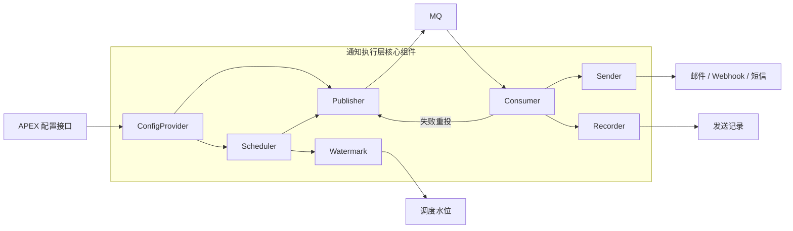
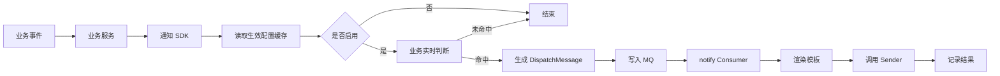
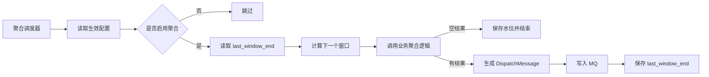
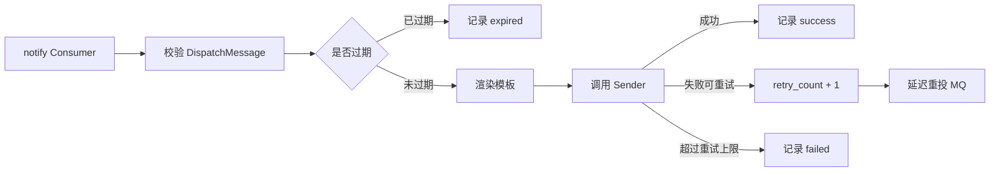

# AES 通知执行层微型设计说明书

## 目录

- [1. 介绍](#1-介绍)
  - [1.1. 目的](#11-目的)
  - [1.2. 核心术语](#12-核心术语)
  - [1.3. 参考和引用](#13-参考和引用)
- [2. 模块方案概述](#2-模块方案概述)
  - [2.1. 范围界定](#21-范围界定)
  - [2.2. 方案选型](#22-方案选型)
  - [2.3. 方案结论](#23-方案结论)
  - [2.4. 总体链路](#24-总体链路)
  - [2.5. 逻辑分层](#25-逻辑分层)
  - [2.6. 核心设计模式](#26-核心设计模式)
- [3. 模块详细设计](#3-模块详细设计)
  - [3.1. 组件职责](#31-组件职责)
  - [3.2. 业务接入契约](#32-业务接入契约)
  - [3.3. 配置模型](#33-配置模型)
  - [3.4. 配置生效](#34-配置生效)
  - [3.5. 实时通知链路](#35-实时通知链路)
  - [3.6. 聚合通知链路](#36-聚合通知链路)
  - [3.7. MQ 消息模型](#37-mq-消息模型)
  - [3.8. 消费、发送与重试](#38-消费发送与重试)
  - [3.9. 模板与渲染](#39-模板与渲染)
  - [3.10. 状态与持久化](#310-状态与持久化)
    - [3.10.1. 发送结果记录表](#3101-发送结果记录表)
    - [3.10.2. 聚合调度水位表](#3102-聚合调度水位表)
    - [3.10.3. 状态定义](#3103-状态定义)
  - [3.11. 幂等设计](#311-幂等设计)
  - [3.12. 异常处理](#312-异常处理)
  - [3.13. 可靠性与观测](#313-可靠性与观测)
  - [3.14. 国际化](#314-国际化)
  - [3.15. 可测试性设计](#315-可测试性设计)
  - [3.16. 可扩展性设计](#316-可扩展性设计)
- [4. 关联分析](#4-关联分析)
  - [4.1. 依赖关系说明](#41-依赖关系说明)
- [5. 变更控制](#5-变更控制)
  - [5.1. 变更列表](#51-变更列表)
- [6. 附录](#6-附录)
  - [A. 默认参数](#a-默认参数)
  - [B. 幂等 Key 示例](#b-幂等-key-示例)
  - [C. 技术指标](#c-技术指标)
  - [D. 核心模块职责](#d-核心模块职责)
- [7. 修订记录](#7-修订记录)

---

## 1. 介绍

### 1.1. 目的

AES 需要提供一套统一通知执行能力，用于承接安全事件、审计结果、系统状态、周期汇总等业务场景下的通知发送需求。

如果通知逻辑分散在各业务服务中，会出现以下问题：

1. 发送、重试、幂等和排障逻辑重复实现
2. 通知配置、模板、接收人和渠道策略难以统一治理
3. 实时通知和聚合通知缺少统一批次协议
4. 失败补偿和问题定位依赖各业务服务自行处理
5. 后续扩展渠道、模板和国际化能力时改造面过大

本方案将通知执行链路收敛为：

- 业务侧负责业务判断和业务变量产出
- SDK 负责生成标准化待发送批次并投递 MQ
- MQ 负责异步承接、削峰和失败后的延迟重投
- notify 服务负责消费、发送、重试、过期判断和结果记录

### 1.2. 核心术语

| 术语 | 说明 |
|------|------|
| Sender | notify 服务内的发送抽象，封装邮件、短信、Webhook 等下游发送能力 |
| Recorder | 发送结果记录抽象，用于审计、排障和统计 |
| Watermark | 聚合调度水位，例如某租户某消息类型的 `last_window_end` |

### 1.3. 参考和引用

- [AES通知配置需求文档.md](./AES通知配置需求文档.md)
- [AES通知二方库与执行器职责划分.md](./AES通知二方库与执行器职责划分.md)
- [AES通知幂等Key设计.md](./AES通知幂等Key设计.md)
- [归档/可靠性推送方案.md](./归档/可靠性推送方案.md)
- [归档/DB调度方案与MQ方案对比.md](./归档/DB调度方案与MQ方案对比.md)

## 2. 模块方案概述

### 2.1. 范围界定

| 维度 | 范围 |
|------|------|
| 接入方式 | 业务服务通过通知 SDK 生成待发送批次 |
| 承接链路 | MQ 承接实时通知、聚合通知和失败后的延迟重投 |
| 消费执行 | notify 服务消费 MQ，完成发送、重试、过期判断和结果记录 |
| 配置来源 | APEX 提供租户维度生效策略，执行层按接口读取并缓存 |
| 模板能力 | notify 服务按渠道和语言读取模板实例并渲染最终内容 |
| 持久化职责 | 记录发送结果、失败原因、聚合水位和必要审计信息 |
| 不纳入范围 | MQ 集群运维、APEX 内部配置表、具体渠道底座实现 |

### 2.2. 方案选型

- 实时和聚合通知统一进入待发送批次协议
- 第一版选择 MQ 承接待发送批次和失败后的延迟重投
- 数据库只记录发送结果和聚合水位，不作为待发送主队列

| 对比项 | 业务侧直接发送 | DB 批次表扫描 | MQ 承接（推荐） |
|--------|----------------|----------------|-----------------|
| 核心形态 | 业务服务直接调用 notification 或下游发送接口 | 业务写入待发送批次表，执行器扫描、抢占并发送 | Publisher 写 MQ，Consumer 消费并调用 Sender |
| 实时性 | 高，但依赖调用链稳定性 | 取决于扫描频率 | 高，消息入队后即可消费 |
| 可靠性 | 调用前后异常容易漏发，补偿依赖业务侧自建 | 可记录、可补偿，但数据库承担队列语义 | MQ 承接缓冲、消费和延迟重投，链路职责更清晰 |
| 削峰能力 | 弱，业务高峰会直接传导到发送链路 | 中等，依赖扫描和数据库承载能力 | 强，适合异步解耦和积压消费 |
| 排障能力 | 分散在各业务服务 | 可直接查批次表和状态 | 通过 MQ 积压、消费日志和发送记录排查 |
| 实现复杂度 | 低 | 中 | 中 |
| 职责边界 | 业务侧耦合发送、重试和渠道细节 | 执行层承担调度和队列语义 | 执行层聚焦发布、消费、发送和记录 |
| 结论 | 不推荐 | 备选，不作为第一版主链路 | **推荐** |

**设计决策**：AES 通知执行层采用 MQ 承接方案。业务侧通过 SDK 生成标准化待发送批次，由 Publisher 写入 MQ；notify 服务通过 Consumer 消费 MQ，完成模板渲染、Sender 调用、失败重试和结果记录。DB 不作为待发送主队列，仅承担发送结果、失败原因、聚合 Watermark 和必要审计信息的持久化。

### 2.3. 方案结论

本方案明确选择：

- SDK 写 MQ，MQ 是待发送批次主承接链路
- 数据库不作为主队列，不承接待发送批次扫描和抢占
- notify 服务独立承载消费、发送、重试和结果记录
- 聚合调度由通知执行层统一维护，按水位推进窗口
- 配置在写 MQ 前生效，未启用或无配置时不生产批次

通知执行层不把“业务服务直接调用下游发送底座”作为统一方案。业务服务只接入 SDK，不感知最终渠道发送细节。

### 2.4. 总体链路

总体架构组件图：



实时通知链路：



聚合通知链路：



消费执行链路：



### 2.5. 逻辑分层

| 分层 | 职责 |
|------|------|
| 业务接入层 | 业务判断、聚合计算、业务变量和业务幂等标识产出 |
| SDK 分发层 | 读取配置、生成待发送批次、写入 MQ |
| MQ 承接层 | 承接待发送批次、削峰、失败后延迟重投 |
| notify 执行层 | 消费 MQ、渲染模板、调用 Sender、重试和记录结果 |

### 2.6. 核心设计模式

本方案采用以下核心设计模式收敛执行层复杂度：

| 设计模式 | 落点 | 说明 |
|----------|------|------|
| Adapter | Sender | 将邮件、Webhook、短信等下游接口封装为统一发送抽象 |
| Provider | ConfigProvider | 屏蔽 APEX 配置接口和本地缓存细节，对执行层只暴露生效策略读取能力 |
| Publisher / Consumer | Publisher、Consumer | 统一待发送批次生产和消费模型，避免业务侧感知 MQ 细节 |
| Strategy | 业务实时判断、业务聚合实现 | 业务侧按 `message_type` 提供判断和聚合逻辑，执行层只负责调用契约 |
| Repository | Recorder、Watermark | 统一发送记录和聚合水位的持久化访问 |

## 3. 模块详细设计

### 3.1. 组件职责

```text
Business Service
  产生业务事件，提供业务判断、聚合逻辑、biz_vars 和 biz_key

Notify SDK
  读取生效配置
  调用业务侧实时判断或聚合逻辑
  生成 DispatchMessage
  写入 MQ

Config Provider
  按 tenant_id + message_type 提供最终生效策略

Aggregate Scheduler
  扫描启用聚合的配置
  读取和推进 Watermark
  触发聚合批次生产

MQ
  承接 DispatchMessage
  承接失败后的延迟重投消息

notify Consumer
  消费 DispatchMessage
  判断过期和重试次数
  渲染模板
  调用 Sender
  记录发送结果

Sender
  适配邮件、短信、Webhook、企业微信等发送底座

Recorder
  记录发送结果、失败原因和必要审计字段
```

### 3.2. 业务接入契约

业务侧按 `message_type` 提供处理能力。

实时通知需要提供：

- 当前事件是否命中通知条件
- 命中后需要下发的 `biz_vars`
- 该事件的业务幂等标识

聚合通知需要提供：

- 聚合窗口内的业务结果
- 聚合结果对应的 `biz_vars`

聚合请求的最小语义为：

| 字段 | 说明 |
|------|------|
| `tenant_id` | 本次聚合所属租户 |
| `window_start` | 聚合窗口起点，含边界 |
| `window_end` | 聚合窗口终点，不含边界 |
| `config_body` | 业务聚合配置，由具体业务自行解释 |

业务聚合结果只返回 `biz_vars`。渠道、模板、接收人和消息类型由生效策略和接入契约共同确定，避免同一个通知语义在多个位置重复维护。

### 3.3. 配置模型

通知配置分成两类：

1. 分发配置

- `enabled`
- `filter`
- `aggregate_period_minutes`

2. 渲染和发送策略

- `channels`
- `template_code`
- 接收人或接收组
- `locale`

执行层依赖最终生效策略。APEX 内部默认值、租户覆盖和策略合并逻辑不进入执行层。

配置查询维度为：

```text
tenant_id + message_type
```

### 3.4. 配置生效

执行层读取最终生效策略，并在本地缓存。

缓存策略：

- 缓存未加载或超过最大陈旧时间时，同步拉取最新配置
- 缓存超过普通 TTL 但未超过最大陈旧时间时，当前请求继续使用旧缓存，同时后台异步刷新
- 后台刷新必须设置超时，避免刷新任务长期挂住

默认建议值：

- 普通 TTL：`5m`
- 最大陈旧时间：`30m`
- 后台刷新超时：`10s`

配置生效点在写 MQ 前：

- 配置不存在时，跳过批次生产
- `enabled=false` 时，跳过批次生产
- 配置存在且启用时，继续执行业务判断或聚合

第一版消费端不做配置二次判定。已经进入 MQ 的消息按入队时形成的批次语义执行。

### 3.5. 实时通知链路

实时通知处理流程：

1. 业务事件触发
2. SDK 读取当前租户和消息类型的生效配置
3. 配置未启用时结束本次处理
4. 调用业务实时判断逻辑
5. 未命中时结束本次处理
6. 命中后获取业务幂等标识
7. 生成实时通知待发送批次
8. 写入 MQ

实时通知是即时发送语义：

- 初始批次写入 MQ 后即可消费
- 不提供业务预约发送能力
- 失败重试时才通过 MQ 延迟投递控制下一次消费时间

实时通知默认批次语义：

| 字段 | 默认值 |
|------|--------|
| `source` | `realtime` |
| `retry_count` | `0` |
| `expire_at` | `created_at + 5m` |

实时通知幂等 key 由平台包装，但业务幂等部分由业务侧提供。

### 3.6. 聚合通知链路

聚合通知由平台统一调度。

调度逻辑：

1. 周期性读取当前生效配置
2. 处理 `enabled=true` 且 `aggregate_period_minutes > 0` 的配置
3. 根据当前时间和聚合周期计算目标窗口
4. 读取该租户该消息类型的 `last_window_end`
5. 推进下一个待处理窗口
6. 调用业务聚合逻辑
7. 聚合结果为空时跳过批次生产
8. 聚合结果存在时生成聚合通知待发送批次
9. 写入 MQ
10. 保存新的 `last_window_end`

聚合通知也是即时发送语义：

- 聚合窗口命中后立即生产批次并写 MQ
- MQ 消费端发现消息后即可发送
- 第一版不做历史窗口自动补跑

聚合通知默认批次语义：

| 字段 | 默认值 |
|------|--------|
| `source` | `aggregate` |
| `retry_count` | `0` |
| `expire_at` | `created_at + 30m` |

### 3.7. MQ 消息模型

待发送批次统一使用 `DispatchMessage` 承载。

核心字段：

| 字段 | 说明 |
|------|------|
| `message_id` | 本次待发送批次唯一标识 |
| `idempotency_key` | 业务语义幂等标识 |
| `tenant_id` | 租户标识 |
| `message_type` | 消息类型 |
| `source` | `realtime` 或 `aggregate` |
| `retry_count` | 当前重试次数 |
| `created_at` | 批次创建时间 |
| `expire_at` | 过期时间 |
| `biz_vars` | 业务变量 |
| `event_body` | 实时事件原始内容，可选 |

设计要点：

- MQ 消息不承接业务预约发送能力
- 首次投递后即可消费
- 失败重试由 MQ 延迟投递承接
- 消费端根据 `expire_at` 和 `retry_count` 判断是否继续发送

### 3.8. 消费、发送与重试

消费端处理流程：

1. 校验 `DispatchMessage`
2. 当前时间晚于 `expire_at` 时，记录 `expired`
3. 未过期时渲染模板并调用 `Sender`
4. 发送成功后记录 `success`
5. 发送失败且未超过重试上限时，增加 `retry_count` 并延迟重投 MQ
6. 发送失败且达到重试上限时，记录 `failed`

默认重试参数：

- 最大重试次数：`3`
- 默认重试间隔：`1m`

执行判断由消息字段和 MQ 延迟投递共同完成：

| 判断项 | 依据 |
|--------|------|
| 是否还能发 | `expire_at` |
| 是否继续重试 | `retry_count` |
| 何时重试 | MQ 延迟投递时间 |

### 3.9. 模板与渲染

模板渲染输入分成两部分：

- `.biz`：业务侧提供的变量
- `.sys`：平台侧补充的系统变量

当前平台侧系统变量包括：

- `window_label`

渠道模板规则：

| 渠道 | 模板规则 |
|------|----------|
| `email` | 标题模板 + 正文模板 |
| `webhook` | 单一文本模板 |
| `sms` | `template_code + kv`，由短信渠道模板体系处理 |

模板边界：

- 模板负责展示层拼装
- 业务侧在 `biz_vars` 中提供可直接展示的变量
- 平台侧补充通用系统变量
- 模板路径限制在渠道模板根目录下
- 读取后的模板实例可以缓存，避免重复读取和编译

### 3.10. 状态与持久化

数据库只承接执行结果和调度状态，不作为待发送主队列。待发送批次由 MQ 承接，失败后的延迟重投也由 MQ 承接。

OceanBase 表设计约束：

- 通知执行层的高频查询应尽量携带 `tenant_id`，便于按分区路由
- 时间字段统一使用 `DATETIME(6)`，由应用侧按统一时区写入
- 第一版不在数据库层做幂等唯一约束，业务侧负责保证 `idempotency_key` 生成逻辑

第一版设计两类持久化表：

1. 发送结果记录表
2. 聚合调度水位表

不设计待发送批次表，避免数据库同时承担队列、抢占和消费调度职责。

#### 3.10.1. 发送结果记录表

表名建议：

```text
notify_send_record
```

用途：

- 记录每个 `DispatchMessage` 的最终执行结果
- 支持审计、排障、统计和幂等结果查询
- 不参与待发送扫描，不承担队列语义

字段设计：

| 字段 | 类型 | 必填 | 说明 |
|------|------|------|------|
| `message_id` | VARCHAR(128) | 是 | 待发送批次唯一标识 |
| `idempotency_key` | VARCHAR(256) | 是 | 业务语义幂等 key |
| `tenant_id` | VARCHAR(64) | 是 | 租户标识 |
| `message_type` | VARCHAR(128) | 是 | 消息类型 |
| `source` | VARCHAR(32) | 是 | `realtime` 或 `aggregate` |
| `status` | VARCHAR(32) | 是 | `success`、`failed`、`expired` |
| `retry_count` | INT | 是 | 最终重试次数 |
| `error_message` | VARCHAR(1024) | 否 | 最终失败原因或过期原因 |
| `created_at` | DATETIME(6) | 是 | 批次创建时间 |
| `expire_at` | DATETIME(6) | 是 | 批次过期时间 |
| `updated_at` | DATETIME(6) | 是 | 记录更新时间 |

索引设计：

| 索引 | 字段 | 说明 |
|------|------|------|
| 主键 | `tenant_id, message_id` | 租户内按批次唯一记录 |
| 普通索引 | `tenant_id, message_type, created_at` | 支持按租户和消息类型统计 |
| 普通索引 | `tenant_id, status, updated_at` | 支持租户内失败、过期记录排查 |
| 普通索引 | `tenant_id, idempotency_key` | 支持按业务幂等 key 查询记录 |


记录粒度：

- 第一版按批次记录最终结果，不展开到接收人明细
- 如果后续需要按渠道、接收人、响应码做精细审计，可扩展 `notify_send_record_detail`
- 明细表不影响主链路，主表仍以 `message_id` 表示一次待发送批次的最终状态


#### 3.10.2. 聚合调度水位表

表名建议：

```text
notify_aggregate_watermark
```

用途：

- 记录某租户某消息类型已经完成处理的聚合窗口
- 防止同一聚合窗口重复生产批次
- 支持调度器重启后从上次水位继续推进

字段设计：

| 字段 | 类型 | 必填 | 说明 |
|------|------|------|------|
| `tenant_id` | VARCHAR(64) | 是 | 租户标识 |
| `message_type` | VARCHAR(128) | 是 | 消息类型 |
| `last_window_end` | DATETIME(6) | 是 | 已完成处理的最后一个窗口结束时间 |
| `version` | BIGINT | 是 | 乐观更新版本号 |
| `created_at` | DATETIME(6) | 是 | 记录创建时间 |
| `updated_at` | DATETIME(6) | 是 | 记录更新时间 |

索引设计：

| 索引 | 字段 | 说明 |
|------|------|------|
| 主键 | `tenant_id, message_type` | 一个租户的一类消息只有一条水位 |
| 普通索引 | `updated_at` | 支持排查长期未推进的水位 |

OceanBase 分区设计：

| 设计项 | 取值 | 说明 |
|--------|------|------|
| 分区方式 | `KEY(tenant_id)` | 与发送记录表保持一致，按租户维度打散 |
| 分区数量 | `16` | 示例值，实际以线上租户规模和 OceanBase 集群规范评估 |
| 时间二级分区 | 无 | 水位表是状态小表，不按时间做物理清理 |
| 主键约束 | 主键包含 `tenant_id` | 与分区键保持一致 |

水位推进规则：

- 聚合结果为空时也推进 `last_window_end`，避免同一空窗口反复执行
- 聚合批次写入 MQ 成功后推进 `last_window_end`
- 水位更新建议使用 `version` 做乐观并发控制
- 分布式锁负责控制同一轮调度并发，水位表负责记录窗口处理进度


#### 3.10.3. 状态定义

发送结果状态第一版收敛为：

- `success`
- `failed`
- `expired`

状态记录用于审计、排障和统计，不承担待发送队列职责。

### 3.11. 幂等设计

幂等 key 必须表达通知业务语义。

#### 3.11.1. 实时通知

实时通知按业务事件幂等。

格式：

```text
realtime:{tenant_id}:{message_type}:{biz_key}
```

其中 `biz_key` 由业务侧提供。

要求：

- 平台侧负责规划幂等 key 格式和包装规则
- 业务侧负责实现业务幂等 key 生成逻辑
- 同一业务事件重复触发时，业务侧生成的 `biz_key` 必须稳定且非空

#### 3.11.2. 聚合通知

聚合通知按窗口幂等。

格式：

```text
aggregate:{tenant_id}:{message_type}:{window_start}:{window_end}
```

要求：

- 同一个窗口重跑时保持 key 不变
- 同一个窗口重试时保持 key 不变
- 延迟重投时保持 key 不变

### 3.12. 异常处理

#### 3.12.1. 配置读取失败

如果没有可用缓存，配置读取失败应返回错误，并跳过本次批次生产。

如果已有未超过最大陈旧时间的缓存，当前请求可以继续使用旧缓存，同时记录后台刷新错误。

#### 3.12.2. 业务判断或聚合失败

业务实时判断或聚合失败时，记录日志后结束本次处理。

这类错误发生在批次生产之前，不写 MQ、不触发消费重试，也不生成发送结果记录。

#### 3.12.3. MQ 写入失败

MQ 写入失败表示待发送批次没有成功进入执行链路。

SDK 应向调用方返回明确错误，由调用方按业务语义决定是否重试本次生产动作。

#### 3.12.4. 消费发送失败

消费端发送失败时，根据 `retry_count` 判断是否延迟重投 MQ。

超过最大重试次数后记录 `failed`。

#### 3.12.5. 消息过期

消息过期后记录 `expired`。

过期属于执行窗口失效，与发送失败分开统计。

### 3.13. 可靠性与观测

关键可靠性约束：

| 风险 | 保障措施 |
|------|----------|
| 业务判断或聚合失败 | 记录日志后结束，不进入 MQ |
| MQ 写入失败 | SDK 返回明确错误，调用侧决定是否重试 |
| 消息重复消费 | 通过 `idempotency_key` 识别重复语义 |
| 消息长期滞留 | 通过 `expire_at` 控制可发送窗口 |
| 下游短暂不可用 | 通过有限重试和 MQ 延迟重投恢复 |
| 聚合重复触发 | 通过窗口水位和窗口幂等 key 控制影响 |

第一版只保留三个核心指标：

- MQ 写入成功率
- 消费发送成功率
- 过期和最终失败数量

日志字段至少包括：

- `message_id`
- `idempotency_key`
- `tenant_id`
- `message_type`
- `source`
- `retry_count`
- `expire_at`
- `status`
- `error_message`

### 3.14. 国际化

第一版支持按语言读取不同模板目录。

模板定位维度：

```text
channel + template_code + locale
```

建议目录结构：

```text
templates/
  zh-CN/
    email/
    webhook/
  en-US/
    email/
    webhook/
```

执行规则：

- 生效策略或租户信息提供 `locale`
- 渲染时按 `locale` 选择模板目录
- 如果目标语言模板不存在，回退到默认语言
- `sys_vars` 中的时间窗口、数字格式和固定文案按 `locale` 生成

### 3.15. 可测试性设计

可测试性目标是覆盖批次生产、消费发送、重试、过期、配置缓存和聚合调度的核心分支。

| 测试类型 | 覆盖内容 | 关注点 |
|----------|----------|--------|
| 单元测试 | ConfigProvider、Publisher、Consumer、Sender、Recorder、Watermark | 正常分支、错误分支、边界时间、空配置 |
| 契约测试 | 业务实时判断和业务聚合接口 | `tenant_id`、`message_type`、`biz_vars`、`biz_key` 的必填和稳定性 |
| 消费链路测试 | MQ 消费、过期判断、重试次数、失败重投 | 不重复记录、失败可重试、超过上限标记 failed |
| 聚合调度测试 | 周期计算、分布式锁、水位推进 | 同一窗口不重复推进，空结果只推进水位 |
| 模板渲染测试 | 渠道模板、语言回退、变量缺失 | 模板不存在、变量缺失、locale 回退 |

内部测试建议提供以下能力：

- 支持构造指定 `tenant_id + message_type` 的测试配置
- 支持手动触发一次聚合调度，用于验证窗口计算和水位推进
- 支持消费指定 `DispatchMessage`，用于验证发送、重试和记录逻辑
- 支持使用 mock Sender、mock Recorder、mock Publisher 验证边界分支

### 3.16. 可扩展性设计

扩展点应通过接口和注册机制控制，避免新增业务类型或渠道时修改主流程。

| 扩展点 | 当前口径 | 可扩展方向 |
|--------|----------|------------|
| Sender | 邮件、Webhook、短信 | 企业微信、IM、站内信等新渠道 |
| 业务处理 | 按 `message_type` 提供实时判断和聚合实现 | 新增业务消息类型 |
| ConfigProvider | APEX 生效策略接口 + 本地缓存 | 配置版本号、增量刷新、灰度策略 |
| Publisher | MQ 投递 | 多 topic、优先级 topic |
| Recorder | 发送结果和失败原因 | 统计聚合、审计检索、告警联动 |
| Watermark | 聚合窗口水位 | 补跑窗口、按租户暂停或重置水位 |
| 模板 | 渠道 + 模板编码 + 语言 | 模板版本、租户级模板覆盖 |

## 4. 关联分析

### 4.1. 依赖关系说明

| 模块 | 关系 |
|------|------|
| APEX | 提供租户维度最终生效策略 |
| MQ | 承接待发送批次和延迟重投 |
| notify 服务 | 独立承载 MQ 消费、模板渲染、Sender 调用、重试和结果记录 |
| 下游发送底座 | 由 `Sender` 适配，执行真实渠道发送 |
| 持久化组件 | 记录发送结果、失败原因、聚合水位和必要审计信息 |
| 业务服务 | 通过 SDK 接入，提供业务判断、聚合逻辑和模板变量 |

## 5. 变更控制

### 5.1. 变更列表

| 变更章节 | 变更内容 | 变更原因 | 变更对老功能、原有设计的影响 |
|----------|----------|----------|------------------------------|
| 1.3 | 增加参考和引用 | 补齐设计文档来源说明 | 无运行影响 |
| 2.2、2.3 | 增加方案选型对比，明确 SDK 写 MQ，数据库不作为主队列 | 收敛执行层主链路 | 业务侧不再直接调用下游发送底座 |
| 2.6 | 增加核心设计模式说明 | 对齐微型设计模板，明确抽象边界 | 无运行影响 |
| 3.7 | 移除业务预约发送语义 | 当前消息发现即发，重试延迟由 MQ 承接 | 不支持业务预约发送 |
| 3.9 | 明确缓存模板实例 | 避免把缓存对象描述成解析结果 | 模板更新需考虑缓存刷新 |
| 3.10 | 补充发送记录表和聚合水位表设计 | 明确数据库持久化边界 | DB 不承担待发送队列职责 |
| 3.13 | 指标收敛为三个核心项 | 降低第一版建设面 | 第一版不覆盖复杂业务统计 |
| 3.14 | 国际化纳入第一版目录选择能力 | 多语言模板可通过目录切换实现 | 需要维护默认语言模板 |
| 3.15、3.16 | 增加可测试性和可扩展性设计 | 补齐评审关注项 | 无运行影响 |
| 4 | 明确 notify 服务独立承载执行 | 收敛执行服务落点 | 业务服务只接入 SDK |

## 6. 附录

### A. 默认参数

| 参数 | 默认值 |
|------|--------|
| 配置缓存 TTL | `5m` |
| 配置最大陈旧时间 | `30m` |
| 后台刷新超时 | `10s` |
| 实时消息过期时间 | `5m` |
| 聚合消息过期时间 | `30m` |
| 消费失败重试间隔 | `1m` |
| 最大重试次数 | `3` |

### B. 幂等 Key 示例

实时通知：

```text
realtime:t_1001:xdr_risk_digest:event-12345
```

聚合通知：

```text
aggregate:t_1001:xdr_risk_digest:2026-04-28T10:00:00Z:2026-04-28T11:00:00Z
```

### C. 技术指标

| 指标 | 目标值 | 说明 |
|------|--------|------|
| 配置缓存普通 TTL | `5m` | 超过后允许后台刷新 |
| 配置最大陈旧时间 | `30m` | 超过后必须同步拉取或跳过批次生产 |
| 实时消息过期时间 | `5m` | 超时后记录 `expired` |
| 聚合消息过期时间 | `30m` | 超时后记录 `expired` |
| 消费失败最大重试次数 | `3` | 超过后记录 `failed` |
| 消费失败重试间隔 | `1m` | 通过 MQ 延迟投递承接 |
| 聚合调度周期 | `1h` | 第一版按小时轮询启用聚合的配置 |

### D. 核心模块职责

| 模块 | 职责 | 关键接口 |
|------|------|----------|
| Notify SDK | 业务侧接入、读取配置、生成待发送批次 | `Send` / `Publish` |
| Publisher | 将 `DispatchMessage` 写入 MQ | `Publish(ctx, message)` |
| Consumer | 消费 MQ 消息、判断过期、调用 Sender、处理重试 | `Consume(ctx, message)` |
| ConfigProvider | 按租户和消息类型读取生效策略 | `GetPolicy(tenant_id, message_type)` |
| Scheduler | 定时扫描聚合配置，触发聚合批次生产 | `RunOnce` / `Tick` |
| Watermark | 读取和推进聚合窗口水位 | `Get` / `Save` |
| Sender | 适配下游发送接口 | `Send(ctx, message)` |
| Recorder | 记录发送结果、失败原因和审计字段 | `Record(ctx, result)` |

## 7. 修订记录

| 修订版本号 | 作者 | 日期 | 简要说明 |
|-----------|------|------|----------|
| 0.1 | - | 2026-04-29 | 初始微型设计，明确 MQ 承接、消费执行和聚合调度方案 |
