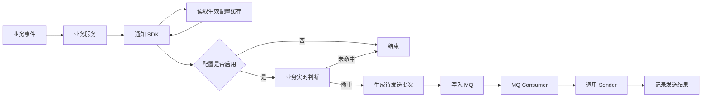
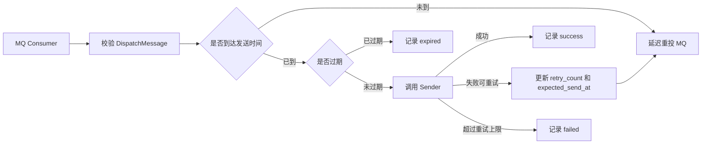

# AES 通知执行层微型设计说明书

## 目录

- [1. 介绍](#1-介绍)
  - [1.1. 目的](#11-目的)
  - [1.2. 定义和缩写](#12-定义和缩写)
  - [1.3. 参考和引用](#13-参考和引用)
- [2. 模块方案概述](#2-模块方案概述)
  - [2.1. 范围界定](#21-范围界定)
  - [2.2. 方案选型](#22-方案选型)
  - [2.3. 总体链路](#23-总体链路)
  - [2.4. 逻辑分层](#24-逻辑分层)
  - [2.5. 核心设计模式](#25-核心设计模式)
  - [2.6. 与业务侧分散接入方案的区别](#26-与业务侧分散接入方案的区别)
- [3. 模块详细设计](#3-模块详细设计)
  - [3.1. 组件职责](#31-组件职责)
  - [3.2. 业务接入契约](#32-业务接入契约)
  - [3.3. 配置模型](#33-配置模型)
  - [3.4. 配置生效](#34-配置生效)
  - [3.5. 实时通知链路](#35-实时通知链路)
  - [3.6. 聚合通知链路](#36-聚合通知链路)
  - [3.7. MQ 消息模型](#37-mq-消息模型)
  - [3.8. 消费、发送与重试](#38-消费发送与重试)
  - [3.9. 模板与渲染](#39-模板与渲染)
  - [3.10. 状态与持久化](#310-状态与持久化)
  - [3.11. 幂等设计](#311-幂等设计)
  - [3.12. 异常处理](#312-异常处理)
  - [3.13. 可靠性保障](#313-可靠性保障)
  - [3.14. 可测试性设计](#314-可测试性设计)
  - [3.15. 可扩展性设计](#315-可扩展性设计)
  - [3.16. 国际化](#316-国际化)
- [4. 关联分析](#4-关联分析)
  - [4.1. 外部依赖](#41-外部依赖)
  - [4.2. 与现有模块关系](#42-与现有模块关系)
- [5. 变更控制](#5-变更控制)
  - [5.1. 变更列表](#51-变更列表)
- [6. 附录](#6-附录)
  - [A. 技术指标](#a-技术指标)
  - [B. 默认参数](#b-默认参数)
  - [C. 幂等 Key 示例](#c-幂等-key-示例)
- [7. 修订记录](#7-修订记录)

---

## 1. 介绍

### 1.1. 目的

AES 需要提供一套统一通知执行能力，用于承接安全事件、审计结果、系统状态、周期汇总等业务场景下的通知发送需求。

当前通知逻辑如果分散在各业务服务中，会带来以下问题：

1. 发送、重试、幂等、限流和排障逻辑重复实现
2. 通知配置、模板、接收人和渠道策略难以统一治理
3. 实时通知和聚合通知缺少统一批次协议
4. 失败补偿和问题定位依赖业务服务自行处理
5. 后续扩展渠道、模板和国际化能力时改造面过大

本方案目标是把通知能力收敛为一套统一执行链路：

- 业务侧负责业务判断和业务变量产出
- SDK 负责生成标准化待发送批次并投递 MQ
- MQ 负责异步承接、削峰和延迟重投
- 消费侧统一完成发送、重试、过期判断和结果记录

### 1.2. 定义和缩写

| 术语/缩写 | 说明 |
|-----------|------|
| APEX | 租户侧通知策略提供方，负责提供最终生效策略 |
| SDK | AES 提供给业务侧的通知接入二方库 |
| MQ | 待发送通知批次的主承接链路，当前按 Pulsar 设计 |
| Producer | SDK 内部的 MQ 生产端能力 |
| Consumer | MQ 消费端，负责消费待发送批次并触发后续发送 |
| Sender | 消费侧真实发送抽象，封装对下游发送底座的调用 |
| Recorder | 发送结果记录抽象，用于审计、排障和统计 |
| Watermark | 聚合调度水位，例如某租户某消息类型的 `last_window_end` |
| message_type | 通知消息类型，用于区分业务语义和配置策略 |
| biz_vars | 业务侧产出的模板变量 |
| sys_vars | 平台侧补充的系统变量 |

### 1.3. 参考和引用

- `AES通知幂等Key设计.md`
- `AES通知二方库与执行器职责划分.md`
- `notifysdk/README.md`
- `notifysdk` 二方库骨架代码
- Pulsar 延迟消息与消费重试能力

---

## 2. 模块方案概述

### 2.1. 范围界定

| 维度 | 范围 |
|------|------|
| 接入方式 | 业务服务通过通知 SDK 生成待发送批次 |
| 承接链路 | MQ 承接实时通知、聚合通知和失败后的延迟重投 |
| 消费执行 | Consumer 统一完成发送、重试、过期判断和结果记录 |
| 配置来源 | APEX 提供租户维度生效策略，执行层按接口读取并缓存 |
| 模板能力 | 执行层按渠道模板渲染最终发送内容 |
| 持久化职责 | 记录发送结果、失败原因、聚合水位和必要审计信息 |
| 外部协作 | APEX 配置表、MQ 集群运维、具体下游渠道发送实现由对应模块承接 |
| 后续演进 | 模板管理后台、完整国际化管理、运营统计查询可在后续版本补齐 |

### 2.2. 方案选型

通知待发送批次的主承接链路有三种可选方案：

| 对比项 | MQ 主承接（推荐） | 数据库批次表主承接 | 业务侧同步发送 |
|--------|------------------|-------------------|---------------|
| 业务解耦 | 高 | 中 | 低 |
| 削峰能力 | 高 | 中 | 低 |
| 延迟重试 | 依赖 MQ 延迟投递，链路清晰 | 依赖扫描、抢占和状态推进 | 依赖业务调用链 |
| 横向扩展 | Consumer 可独立扩展 | 需要处理抢占竞争和扫描压力 | 扩展受业务服务影响 |
| 审计查询 | 通过结果记录补齐 | 天然保留较多中间状态 | 需要额外补齐 |
| 复杂度 | 中 | 高 | 低 |
| 结论 | **推荐** | 适合作为高价值通知的事务 Outbox 补充 | 不推荐作为统一通知能力 |

**设计决策**：通知执行层以 MQ 作为待发送批次的主承接链路；数据库保留发送结果、聚合水位、审计查询和高价值通知 Outbox 等职责。

### 2.3. 总体链路

实时通知链路：



聚合通知链路：


消费执行链路：



### 2.4. 逻辑分层

整体链路分为四层：

| 分层 | 职责 |
|------|------|
| 业务接入层 | 业务判断、业务变量产出、业务幂等标识提供 |
| 分发与调度层 | 读取配置、生成待发送批次、调度聚合窗口、维护聚合水位 |
| MQ 承接层 | 承接待发送批次、削峰、延迟重投、支撑横向消费 |
| 消费执行层 | 消费 MQ、判断发送时机、调用 Sender、重试和记录结果 |

### 2.5. 核心设计模式

| 模式 | 应用场景 | 说明 |
|------|----------|------|
| 适配器模式 | Sender、MQPublisher、Recorder | 屏蔽下游发送底座、MQ 客户端和记录存储差异 |
| 策略模式 | 渠道路由、重试策略、过期策略 | 不同消息类型和渠道可扩展不同执行策略 |
| 模板方法 | 消费执行流程 | 校验、到期判断、发送、重试和记录按固定流程执行 |
| Outbox 模式 | 高价值通知 | 与业务事务强相关的通知可先写本地 Outbox，再由 relay 投递 MQ |

### 2.6. 与业务侧分散接入方案的区别

| 对比项 | 统一通知执行层 | 业务侧分散接入 |
|--------|----------------|---------------|
| 通知协议 | SDK 统一封装 | 各业务服务自行定义 |
| 幂等规则 | 按消息类型统一约束 | 容易随业务实现发散 |
| 重试治理 | Consumer 统一处理 | 各业务服务分别实现 |
| 模板渲染 | 执行层统一处理 | 各业务服务重复处理 |
| 排障入口 | 发送结果和统一日志集中定位 | 依赖各业务服务日志 |
| 扩展渠道 | Sender 适配即可扩展 | 多业务服务同时改造 |

---

## 3. 模块详细设计

### 3.1. 组件职责

```
Business Service
  └─ 产生业务事件、判断业务语义、提供 biz_vars 和 biz_key

Notify SDK
  ├─ Client
  ├─ Command / Envelope
  ├─ MQTransport
  ├─ OutboxTransport
  └─ Metrics

Config Provider
  └─ 按 tenant_id + message_type 提供生效策略

Aggregate Scheduler
  ├─ 扫描启用聚合的配置
  ├─ 读取和推进 Watermark
  └─ 触发业务聚合逻辑

MQ
  └─ 承接 DispatchMessage 和延迟重投消息

Consumer
  ├─ DispatchMessage 校验
  ├─ 到期、过期和重试判断
  ├─ Sender 调用
  └─ Recorder 记录结果

Sender
  └─ 适配邮件、短信、Webhook、企业微信等发送底座

Recorder
  └─ 记录发送结果、失败原因和必要审计字段
```

### 3.2. 业务接入契约

业务侧需要按 `message_type` 提供处理能力。

实时通知需要提供：

- 当前事件是否命中通知条件
- 命中后需要下发的 `biz_vars`
- 该事件的业务幂等标识

聚合通知需要提供：

- 聚合窗口内的业务结果
- 聚合结果对应的 `biz_vars`

聚合请求的最小语义为：

| 字段 | 说明 |
|------|------|
| `tenant_id` | 本次聚合所属租户 |
| `window_start` | 聚合窗口起点，含边界 |
| `window_end` | 聚合窗口终点，不含边界 |
| `config_body` | 业务聚合配置，由具体业务自行解释 |

业务聚合结果以 `biz_vars` 为主。渠道、模板、接收人和 `message_type` 由生效策略和接入契约共同确定，避免同一个通知语义在多个位置重复维护。

### 3.3. 配置模型

通知配置分成两类：

1. 分发配置

- `enabled`
- `realtime_filter`
- `aggregate_filter`
- `aggregate_period_minutes`

2. 渲染和发送策略

- `channels`
- `template_code`
- 接收人或接收组

执行层依赖最终生效策略；APEX 内部的默认值、租户覆盖和策略合并逻辑不进入执行层。

配置查询维度为：

```text
tenant_id + message_type
```

### 3.4. 配置生效

执行层通过配置加载函数获取生效策略，并在本地缓存。

缓存策略：

- 缓存未加载或超过最大陈旧时间时，同步拉取最新配置
- 缓存超过普通 TTL 但未超过最大陈旧时间时，当前请求继续使用旧缓存，同时后台异步刷新
- 后台刷新必须有超时控制，避免刷新任务长期挂住

默认建议值：

- 普通 TTL：`5m`
- 最大陈旧时间：`30m`
- 后台刷新超时：`10s`

配置生效点在写 MQ 前：

- 配置不存在时，跳过批次生产
- `enabled=false` 时，跳过批次生产
- 配置存在且启用时，继续执行业务判断或聚合

消费端主要负责消费、发送、重试和记录。若后续需要解决“配置变更后已入队消息是否继续发送”的问题，可增加消费端二次校验开关。

### 3.5. 实时通知链路

实时通知处理流程：

1. 业务事件触发
2. SDK 读取当前租户和消息类型的生效配置
3. 配置未启用时结束本次处理
4. 调用业务实时判断逻辑
5. 未命中时结束本次处理
6. 命中后获取业务幂等标识
7. 生成实时通知待发送批次
8. 写入 MQ

实时通知默认批次语义：

| 字段 | 默认值 |
|------|--------|
| `source` | `realtime` |
| `retry_count` | `0` |
| `expected_send_at` | `created_at` |
| `expire_at` | `created_at + 5m` |

实时通知幂等 key 由平台包装，但业务幂等部分由业务侧提供。

### 3.6. 聚合通知链路

聚合通知由平台统一调度。

调度逻辑：

1. 周期性读取当前生效配置
2. 处理 `enabled=true` 且 `aggregate_period_minutes > 0` 的配置
3. 根据当前时间和聚合周期计算目标窗口
4. 读取该租户该消息类型的 `last_window_end`
5. 推进下一个待处理窗口
6. 调用业务聚合逻辑
7. 聚合结果为空时跳过批次生产
8. 聚合结果存在时生成聚合通知待发送批次
9. 写入 MQ
10. 保存新的 `last_window_end`

聚合通知默认批次语义：

| 字段 | 默认值 |
|------|--------|
| `source` | `aggregate` |
| `retry_count` | `0` |
| `expected_send_at` | `created_at` |
| `expire_at` | `created_at + 30m` |

聚合调度第一版每轮推进一个窗口。历史补跑作为单独运维动作或补偿任务设计，避免常规调度在长时间停机后一次性放大压力。

### 3.7. MQ 消息模型

待发送批次统一使用 `DispatchMessage` 承载。

核心字段：

| 字段 | 说明 |
|------|------|
| `message_id` | 本次待发送批次唯一标识 |
| `idempotency_key` | 业务语义幂等标识 |
| `tenant_id` | 租户标识 |
| `message_type` | 消息类型 |
| `source` | `realtime` 或 `aggregate` |
| `retry_count` | 当前重试次数 |
| `created_at` | 批次创建时间 |
| `expected_send_at` | 期望发送时间 |
| `expire_at` | 过期时间 |
| `biz_vars` | 业务变量 |
| `event_body` | 实时事件原始内容，可选 |

设计要点：

- MQ 消息本身携带重试次数和下一次发送时间
- 延迟重投由 MQ 消息字段推进
- 消费端根据消息体判断是否发送、重投或过期

### 3.8. 消费、发送与重试

消费端处理流程：

1. 校验 `DispatchMessage`
2. 当前时间早于 `expected_send_at` 时，原样延迟重投 MQ
3. 当前时间晚于 `expire_at` 时，记录 `expired`
4. 到达发送时间且未过期时，调用 `Sender`
5. 发送成功后记录 `success`
6. 发送失败且未超过重试上限时，增加 `retry_count` 并延后 `expected_send_at` 后重投 MQ
7. 发送失败且达到重试上限时，记录 `failed`

默认重试参数：

- 最大重试次数：`3`
- 默认重试间隔：`1m`

执行判断由消息字段驱动：

| 判断项 | 字段 |
|--------|------|
| 是否该发 | `expected_send_at` |
| 是否还能发 | `expire_at` |
| 是否继续重试 | `retry_count` |

### 3.9. 模板与渲染

模板渲染输入分成两部分：

- `.biz`：业务侧提供的变量
- `.sys`：平台侧补充的系统变量

当前平台侧系统变量包括：

- `window_label`

渠道模板规则：

| 渠道 | 模板规则 |
|------|----------|
| `email` | 标题模板 + 正文模板 |
| `webhook` | 单一文本模板 |
| `sms` | `template_code + kv`，由短信渠道模板体系处理 |

模板边界：

- 模板负责展示层拼装
- 业务侧在 `biz_vars` 中提供可直接展示的变量
- 平台侧补充通用系统变量
- 模板路径限制在渠道模板根目录下
- 模板解析结果可以缓存，避免重复读取和编译

### 3.10. 状态与持久化

持久化组件建议承担以下职责：

1. 发送结果记录

- `message_id`
- `idempotency_key`
- `tenant_id`
- `message_type`
- `source`
- `status`
- `retry_count`
- `error_message`
- `created_at`
- `expected_send_at`
- `expire_at`
- `updated_at`

2. 聚合调度水位

- `tenant_id`
- `message_type`
- `last_window_end`
- `updated_at`

状态建议先收敛为：

- `success`
- `failed`
- `expired`

如果后续需要更强的审计和运营能力，可以扩展：

- `skipped`
- `rate_limited`
- `terminal_failed`

### 3.11. 幂等设计

幂等 key 必须表达通知业务语义。

#### 3.11.1. 实时通知

实时通知按业务事件幂等。

格式：

```text
realtime:{tenant_id}:{message_type}:{biz_key}
```

其中 `biz_key` 由业务侧提供。

要求：

- 同一业务事件重复触发时，`biz_key` 必须稳定
- `biz_key` 需要非空
- 平台基于业务事件生成实时幂等 key

#### 3.11.2. 聚合通知

聚合通知按窗口幂等。

格式：

```text
aggregate:{tenant_id}:{message_type}:{window_start}:{window_end}
```

要求：

- 同一个窗口重跑时保持 key 不变
- 同一个窗口重试时保持 key 不变
- 延迟发送时保持 key 不变

### 3.12. 异常处理

#### 3.12.1. 配置读取失败

如果没有可用缓存，配置读取失败应返回错误，并跳过本次批次生产。

如果已有未超过最大陈旧时间的缓存，当前请求可以继续使用旧缓存，同时记录后台刷新错误和指标。

#### 3.12.2. 业务判断或聚合失败

业务实时判断或聚合失败时，跳过 MQ 投递。

这类错误属于生产待发送批次之前的错误，应在调用侧记录并暴露指标。

#### 3.12.3. MQ 写入失败

MQ 写入失败表示待发送批次没有成功进入执行链路。

调用方应拿到明确错误，由上层决定是否重试本次生产动作。

#### 3.12.4. 消费发送失败

消费端发送失败时，根据 `retry_count` 判断是否重投 MQ。

超过最大重试次数后记录 `failed`。

#### 3.12.5. 消息过期

消息过期后记录 `expired`。

过期属于执行窗口失效，与发送失败分开统计。

### 3.13. 可靠性保障

| 风险 | 保障措施 |
|------|----------|
| MQ 写入失败 | SDK 返回明确错误，调用侧按业务语义决定是否重试 |
| 消息重复消费 | 通过 `idempotency_key` 和结果记录保证重复消息可识别 |
| 消息长期滞留 | 通过 `expire_at` 控制可发送窗口 |
| 下游短暂不可用 | 通过有限重试和 MQ 延迟重投恢复 |
| 配置服务短暂不可用 | 使用未超过最大陈旧时间的缓存继续处理 |
| 聚合调度重复执行 | 通过窗口水位和窗口幂等 key 控制重复影响 |
| 模板路径穿越 | 模板路径限制在渠道模板根目录下 |

建议至少建设以下指标：

- MQ 写入成功数、失败数
- MQ 消费成功数、失败数
- 消费延迟
- 发送成功数、失败数
- 重试次数分布
- 过期消息数
- 配置缓存刷新成功数、失败数
- 聚合调度窗口推进数

日志字段至少包括：

- `message_id`
- `idempotency_key`
- `tenant_id`
- `message_type`
- `source`
- `retry_count`
- `expected_send_at`
- `expire_at`
- `status`
- `error_message`

### 3.14. 可测试性设计

建议覆盖以下测试：

| 测试类型 | 覆盖内容 |
|----------|----------|
| SDK 单元测试 | 参数校验、幂等 key 生成、Envelope 序列化 |
| 配置缓存测试 | TTL、最大陈旧时间、后台刷新超时 |
| 实时通知链路测试 | 配置关闭、未命中、命中写 MQ、MQ 写入失败 |
| 聚合调度测试 | 窗口计算、水位推进、空结果、重复窗口 |
| Consumer 测试 | 未到发送时间、过期、成功、失败重试、超过重试上限 |
| 模板渲染测试 | 不同渠道模板、变量缺失、路径限制 |
| 幂等测试 | 实时事件重复触发、聚合窗口重跑 |

内部调试可提供手动触发能力：

- 触发某租户某 `message_type` 的聚合窗口
- 重放指定 `DispatchMessage`
- 查询指定 `idempotency_key` 的发送结果

### 3.15. 可扩展性设计

| 扩展点 | 当前实现 | 可扩展方向 |
|--------|----------|------------|
| Sender | 邮件、短信、Webhook 等基础渠道 | 企业微信、钉钉、自定义 Webhook |
| Recorder | 发送结果记录 | 运营统计、审计查询、问题工单联动 |
| RetryPolicy | 固定次数和固定间隔 | 指数退避、按渠道差异化策略 |
| ConfigProvider | APEX 生效策略接口 | 本地缓存预热、灰度策略、配置变更事件 |
| TemplateRenderer | 本地模板渲染 | 模板版本管理、模板预览、国际化模板 |
| Outbox | 高价值通知事务内写本地表 | Relay 独立扩容、死信补偿 |

### 3.16. 国际化

第一版以现有渠道模板为主。

后续如果通知内容需要多语言能力，建议从以下维度扩展：

- 生效策略中增加语言选择
- 模板按 `template_code + locale` 管理
- `sys_vars` 提供本地化时间、数字和窗口标签
- 缺省语言回退规则由模板管理侧统一定义

---

## 4. 关联分析

### 4.1. 外部依赖

| 依赖 | 关系说明 |
|------|----------|
| APEX | 提供租户维度最终生效策略 |
| MQ | 承接待发送批次和延迟重投 |
| 下游发送底座 | 由 `Sender` 适配，执行真实渠道发送 |
| 持久化组件 | 记录发送结果、失败原因、聚合水位和必要审计信息 |
| 业务服务 | 提供业务判断、聚合逻辑和模板变量 |

### 4.2. 与现有模块关系

| 模块 | 关系 |
|------|------|
| `notifysdk` | 作为业务侧统一接入入口，封装 `Command`、`Envelope`、Transport 和 Metrics |
| `aes-crontab` | 可承载聚合调度或消费执行进程，具体落点按现有服务边界确定 |
| `notification client` | 封装对下游发送底座的 HTTP 调用细节 |
| 业务微服务 | 通过 SDK 接入，消费端发送、重试和模板渲染细节由执行层承接 |

---

## 5. 变更控制

### 5.1. 变更列表

| 变更章节 | 变更内容 | 变更原因 | 对原有设计的影响 |
|----------|----------|----------|------------------|
| 2.2 | 明确 MQ 主承接、数据库保留记录和 Outbox 补充职责 | 收敛执行层主链路 | 数据库批次表调整为补充方案 |
| 3.10 | 状态持久化聚焦发送结果和聚合水位 | 降低执行状态机复杂度 | 查询和审计仍可通过结果记录满足 |
| 3.13 | 增加可靠性保障矩阵 | 便于评审关注风险闭环 | 无代码约束变化 |

---

## 6. 附录

### A. 技术指标

| 指标 | 建议目标 | 说明 |
|------|----------|------|
| SDK 写 MQ 成功率 | >= 99.9% | 按调用次数统计 |
| Consumer 单消息处理延迟 | P95 < 1s，不含下游发送耗时 | 从消费到完成本地处理 |
| 实时通知默认过期时间 | 5m | 超过窗口后记录 `expired` |
| 聚合通知默认过期时间 | 30m | 适配周期汇总场景 |
| 最大重试次数 | 3 | 可按渠道扩展 |

### B. 默认参数

| 参数 | 默认值 |
|------|--------|
| 配置缓存 TTL | `5m` |
| 配置最大陈旧时间 | `30m` |
| 后台刷新超时 | `10s` |
| 实时消息过期时间 | `5m` |
| 聚合消息过期时间 | `30m` |
| 消费失败重试间隔 | `1m` |
| 最大重试次数 | `3` |

### C. 幂等 Key 示例

实时通知：

```text
realtime:t_1001:xdr_risk_digest:event-12345
```

聚合通知：

```text
aggregate:t_1001:xdr_risk_digest:2026-04-28T10:00:00Z:2026-04-28T11:00:00Z
```

---

## 7. 修订记录

| 修订版本号 | 作者 | 日期 | 简要说明 |
|------------|------|------|----------|
| v0.3 | - | 2026-04-29 | 按 DR2 微型设计说明书结构调整，弱化边界口号化表述，补充方案选型、可靠性、可测试性和变更控制 |
| v0.2 | - | 2026-04-29 | 按当前执行层方案重写，主链路收敛为 SDK 写 MQ、Consumer 发送和重试 |
| v0.1 | - | 2026-04-27 | 早期评审稿 |
