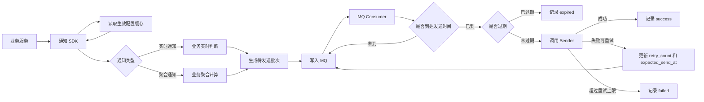
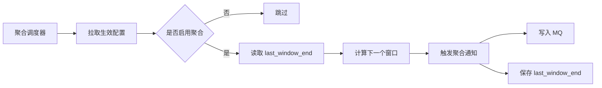

# AES 通知能力总体评审方案

## 目录

- [1. 介绍](#1-介绍)
  - [1.1. 目的](#11-目的)
  - [1.2. 定义和缩写](#12-定义和缩写)
  - [1.3. 设计原则](#13-设计原则)
- [2. 模块方案概述](#2-模块方案概述)
  - [2.1. 范围界定](#21-范围界定)
  - [2.2. 方案结论](#22-方案结论)
  - [2.3. 总体链路](#23-总体链路)
  - [2.4. 逻辑分层](#24-逻辑分层)
  - [2.5. 分层职责](#25-分层职责)
- [3. 模块详细设计](#3-模块详细设计)
  - [3.1. 接入边界](#31-接入边界)
  - [3.2. 业务接入契约](#32-业务接入契约)
  - [3.3. 配置模型](#33-配置模型)
  - [3.4. 配置生效](#34-配置生效)
  - [3.5. 实时通知链路](#35-实时通知链路)
  - [3.6. 聚合通知链路](#36-聚合通知链路)
  - [3.7. MQ 消息模型](#37-mq-消息模型)
  - [3.8. 消费、发送与重试](#38-消费发送与重试)
  - [3.9. 模板与渲染](#39-模板与渲染)
  - [3.10. 状态与持久化边界](#310-状态与持久化边界)
  - [3.11. 幂等设计](#311-幂等设计)
  - [3.12. 异常处理](#312-异常处理)
  - [3.13. 可观测性](#313-可观测性)
- [4. 方案取舍](#4-方案取舍)
  - [4.1. 为什么 SDK 写 MQ](#41-为什么-sdk-写-mq)
  - [4.2. 为什么数据库不作为主队列](#42-为什么数据库不作为主队列)
  - [4.3. 数据库仍然保留哪些职责](#43-数据库仍然保留哪些职责)
- [5. 关联分析](#5-关联分析)
- [6. 附录](#6-附录)
  - [6.1. 幂等 Key 示例](#61-幂等-key-示例)
  - [6.2. 默认参数](#62-默认参数)
- [7. 修订记录](#7-修订记录)

---

## 1. 介绍

### 1.1. 目的

AES 需要提供一套统一通知能力，用于承接安全事件、审计结果、系统状态、周期汇总等不同业务场景下的通知发送需求。

这类能力如果完全散在各业务服务中，会带来以下问题：

- 各业务服务重复实现发送、重试、幂等、限流和排障逻辑
- 通知配置、模板、接收人和渠道策略难以统一治理
- 实时通知和聚合通知缺少统一的批次协议
- 失败补偿和问题定位依赖各业务服务自行处理
- 后续扩展渠道、模板和国际化能力时改造面过大

本方案的目标是把通知能力收敛为一套统一执行链路：

- 业务侧只负责业务判断和业务变量产出
- SDK 负责生成标准化待发送批次并写入 MQ
- MQ 负责异步承接、削峰和延迟重投
- 消费侧统一完成发送、重试、过期判断和结果记录

### 1.2. 定义和缩写

| 术语/缩写 | 说明 |
|-----------|------|
| APEX | 租户侧通知策略提供方，负责提供最终生效策略 |
| SDK | AES 提供给业务侧的通知接入二方库 |
| MQ | 待发送通知批次的主承接链路，当前按 Pulsar 设计 |
| Producer | SDK 内部的 MQ 生产端能力 |
| Consumer | MQ 消费端，负责消费待发送批次并触发后续发送 |
| Sender | 消费侧真实发送抽象，封装对下游发送底座的调用 |
| Recorder | 发送结果记录抽象，用于审计、排障和统计 |
| Watermark | 聚合调度水位，例如某租户某消息类型的 `last_window_end` |
| message_type | 通知消息类型，用于区分业务语义和配置策略 |
| biz_vars | 业务侧产出的模板变量 |
| sys_vars | 平台侧补充的系统变量 |

### 1.3. 设计原则

本方案遵循以下原则：

- 主链路不以数据库作为队列，待发送批次通过 MQ 承接
- 业务服务不直接调用最终发送底座
- 业务服务不直接拼接最终发送协议
- 幂等 key 表达业务语义，不表达本次执行时间
- 发送失败通过 MQ 延迟重投和有限重试处理
- 数据库只承担必要的记录、水位和审计职责，不承担主队列职责

## 2. 模块方案概述

### 2.1. 范围界定

#### 2.1.1. 本次纳入范围

- 业务侧通知接入契约
- SDK 生成并投递 MQ 待发送批次
- 实时通知与聚合通知的统一消息模型
- 配置读取与缓存
- 消费侧发送、重试、过期和记录
- 聚合调度水位
- 模板变量边界和渲染模型

#### 2.1.2. 本次不纳入范围

- APEX 内部配置表设计
- MQ 集群部署和运维方案
- 具体下游渠道发送实现
- 具体数据库表 DDL
- 模板管理后台和完整国际化管理能力

### 2.2. 方案结论

本次方案收敛如下：

- 通知接入采用 SDK 方式
- SDK 负责把待发送批次写入 MQ
- MQ 是通知执行层的主承接链路
- 消费端统一执行发送、重试和结果记录
- 数据库不作为待发送批次主队列
- 聚合通知由平台按配置和水位统一调度
- 租户侧生效策略由 APEX 提供，AES 运行时按接口消费并缓存

### 2.3. 总体链路



聚合调度链路：



### 2.4. 逻辑分层

整体链路分为四层：

- 业务接入层
- 分发与调度层
- MQ 承接层
- 消费执行层

### 2.5. 分层职责

#### 2.5.1. 业务接入层

负责：

- 实现具体业务语义
- 判断实时事件是否命中通知条件
- 生成业务模板变量 `biz_vars`
- 为实时事件提供稳定业务幂等标识

不负责：

- 直接调用最终发送底座
- 自己处理 MQ 生产者生命周期
- 自己处理重试、过期和失败记录

#### 2.5.2. 分发与调度层

负责：

- 读取租户生效配置
- 调用业务侧实时判断或聚合逻辑
- 生成统一 MQ 待发送批次
- 生成幂等 key、过期时间和发送时间
- 调度聚合窗口并维护聚合水位

#### 2.5.3. MQ 承接层

负责：

- 承接待发送批次
- 解耦业务触发和真实发送
- 承接失败后的延迟重投
- 支撑消费端横向扩展

#### 2.5.4. 消费执行层

负责：

- 消费 MQ 待发送批次
- 判断是否到达发送时间
- 判断是否过期
- 调用真实发送器
- 失败后按策略重投
- 记录最终结果

## 3. 模块详细设计

### 3.1. 接入边界

业务服务接入通知能力时，不直接写数据库，也不直接调用最终发送底座。

统一接入方式为：

1. 业务侧引入通知 SDK
2. 业务侧提供消息类型、租户、事件或聚合窗口等输入
3. SDK 按统一契约生成待发送批次
4. SDK 将待发送批次写入 MQ

这个边界的核心是：

- 业务侧负责业务事实
- SDK 负责通知批次协议
- MQ 负责异步承接
- 消费端负责最终发送治理

### 3.2. 业务接入契约

业务侧需要按 `message_type` 提供处理能力。

实时通知需要提供：

- 当前事件是否命中通知条件
- 命中后需要下发的 `biz_vars`
- 该事件的业务幂等标识

聚合通知需要提供：

- 聚合窗口内的业务结果
- 聚合结果对应的 `biz_vars`

聚合请求的最小语义为：

| 字段 | 说明 |
|------|------|
| `tenant_id` | 本次聚合所属租户 |
| `window_start` | 聚合窗口起点，含边界 |
| `window_end` | 聚合窗口终点，不含边界 |
| `config_body` | 业务聚合配置，由具体业务自行解释 |

业务聚合结果只返回 `biz_vars`，不返回渠道、模板、接收人，也不返回 `message_type`。`message_type` 由接入契约自身声明，避免同一个语义在多个位置重复维护。

### 3.3. 配置模型

通知配置分成两类：

1. 分发配置

- `enabled`
- `realtime_filter`
- `aggregate_filter`
- `aggregate_period_minutes`

2. 渲染和发送策略

- `channels`
- `template_code`
- 接收人或接收组

当前执行层只依赖最终生效策略，不关心 APEX 内部如何组织默认值、租户覆盖和策略合并。

配置查询维度为：

```text
tenant_id + message_type
```

### 3.4. 配置生效

执行层通过配置加载函数获取生效策略，并在本地缓存。

缓存策略：

- 缓存未加载或超过最大陈旧时间时，同步拉取最新配置
- 缓存超过普通 TTL 但未超过最大陈旧时间时，当前请求继续使用旧缓存，同时后台异步刷新
- 后台刷新必须有超时控制，避免刷新任务长期挂住

默认建议值：

- 普通 TTL：`5m`
- 最大陈旧时间：`30m`
- 后台刷新超时：`10s`

配置生效点在写 MQ 前：

- 如果配置不存在，直接不产生待发送批次
- 如果 `enabled=false`，直接不产生待发送批次
- 如果配置存在且启用，继续执行业务判断或聚合

当前方案不把配置二次判定放在消费端作为主流程。消费端主要负责消费、发送、重试和记录。

### 3.5. 实时通知链路

实时通知链路如下：

1. 业务事件触发
2. SDK 读取当前租户和消息类型的生效配置
3. 配置未启用时直接结束
4. 调用业务实时判断逻辑
5. 未命中时直接结束
6. 命中后获取业务幂等标识
7. 生成实时通知待发送批次
8. 写入 MQ

实时通知默认批次语义：

- `source = realtime`
- `retry_count = 0`
- `expected_send_at = created_at`
- `expire_at = created_at + 5m`

实时通知幂等 key 由平台包装，但业务幂等部分由业务侧提供。

### 3.6. 聚合通知链路

聚合通知由平台统一调度。

调度逻辑：

1. 周期性读取当前生效配置
2. 只处理 `enabled=true` 且 `aggregate_period_minutes > 0` 的配置
3. 根据当前时间和聚合周期计算目标窗口
4. 读取该租户该消息类型的 `last_window_end`
5. 推进下一个待处理窗口
6. 调用业务聚合逻辑
7. 如果聚合结果为空，不生成待发送批次
8. 如果聚合结果存在，生成聚合通知待发送批次
9. 写入 MQ
10. 保存新的 `last_window_end`

聚合通知默认批次语义：

- `source = aggregate`
- `retry_count = 0`
- `expected_send_at = created_at`
- `expire_at = created_at + 30m`

聚合调度第一版只推进一个窗口，不自动一次性补齐所有历史窗口。历史补跑如果需要，应作为单独运维动作或补偿任务设计。

### 3.7. MQ 消息模型

待发送批次统一使用 `DispatchMessage` 承载。

核心字段：

| 字段 | 说明 |
|------|------|
| `message_id` | 本次待发送批次唯一标识 |
| `idempotency_key` | 业务语义幂等标识 |
| `tenant_id` | 租户标识 |
| `message_type` | 消息类型 |
| `source` | `realtime` 或 `aggregate` |
| `retry_count` | 当前重试次数 |
| `created_at` | 批次创建时间 |
| `expected_send_at` | 期望发送时间 |
| `expire_at` | 过期时间 |
| `biz_vars` | 业务变量 |
| `event_body` | 实时事件原始内容，可选 |

设计要点：

- MQ 消息本身携带重试次数和下一次发送时间
- 延迟重投不依赖数据库状态推进
- 消费端可以只根据消息体判断是否发送、重投或过期

### 3.8. 消费、发送与重试

消费端处理流程：

1. 校验 `DispatchMessage`
2. 如果当前时间早于 `expected_send_at`，原样重投 MQ
3. 如果当前时间晚于 `expire_at`，记录 `expired`
4. 如果到达发送时间且未过期，调用 `Sender`
5. 发送成功，记录 `success`
6. 发送失败且未超过重试上限，增加 `retry_count` 并延后 `expected_send_at` 后重投 MQ
7. 发送失败且达到重试上限，记录 `failed`

默认重试参数：

- 最大重试次数：`3`
- 默认重试间隔：`1m`

这里的状态不是数据库驱动状态机，而是 MQ 消息驱动的执行状态：

- 是否该发，由 `expected_send_at` 决定
- 是否还能发，由 `expire_at` 决定
- 是否继续重试，由 `retry_count` 决定

### 3.9. 模板与渲染

模板渲染输入分成两部分：

- `.biz`：业务侧提供的变量
- `.sys`：平台侧补充的系统变量

当前平台侧系统变量包括：

- `window_label`

渠道模板规则：

- `email` 使用标题模板和正文模板
- `webhook` 使用单一文本模板
- `sms` 使用 `template_code + kv`，不走本地文本模板渲染

模板边界：

- 模板只负责展示，不承接复杂业务判断
- 业务侧应在 `biz_vars` 中提供可直接展示的变量
- 平台侧补充通用系统变量
- 模板路径必须限制在渠道模板根目录下
- 模板解析结果可以缓存，避免重复读取和编译

### 3.10. 状态与持久化边界

当前方案不要求数据库承接待发送批次。

数据库或其他持久化组件只建议承担以下职责：

1. 发送结果记录

- `message_id`
- `idempotency_key`
- `tenant_id`
- `message_type`
- `source`
- `status`
- `retry_count`
- `error_message`
- `created_at`
- `expected_send_at`
- `expire_at`
- `updated_at`

2. 聚合调度水位

- `tenant_id`
- `message_type`
- `last_window_end`
- `updated_at`

状态建议先收敛为：

- `success`
- `failed`
- `expired`

如果后续需要更强的审计和运营能力，可以扩展：

- `skipped`
- `rate_limited`
- `terminal_failed`

但这些状态不应改变主链路：待发送批次仍由 MQ 承接。

### 3.11. 幂等设计

幂等 key 必须表达通知业务语义，不表达本次执行时间。

#### 3.11.1. 实时通知

实时通知按业务事件幂等。

格式：

```text
realtime:{tenant_id}:{message_type}:{biz_key}
```

其中 `biz_key` 由业务侧提供。

要求：

- 同一业务事件重复触发时，`biz_key` 必须稳定
- `biz_key` 不能为空
- 平台不根据当前时间生成实时幂等 key

#### 3.11.2. 聚合通知

聚合通知按窗口幂等。

格式：

```text
aggregate:{tenant_id}:{message_type}:{window_start}:{window_end}
```

要求：

- 同一个窗口重跑不换 key
- 同一个窗口重试不换 key
- 延迟发送不换 key

### 3.12. 异常处理

#### 3.12.1. 配置读取失败

如果没有可用缓存，配置读取失败应返回错误，不生成待发送批次。

如果已有未超过最大陈旧时间的缓存，当前请求可以继续使用旧缓存，同时后台刷新错误需要记录日志和指标。

#### 3.12.2. 业务判断或聚合失败

业务实时判断或聚合失败时，不写 MQ。

这类错误属于生产待发送批次之前的错误，应在调用侧记录并暴露指标。

#### 3.12.3. MQ 写入失败

MQ 写入失败表示待发送批次没有成功进入执行链路。

调用方应拿到明确错误，由上层决定是否重试本次生产动作。

#### 3.12.4. 消费发送失败

消费端发送失败时，根据 `retry_count` 判断是否重投 MQ。

超过最大重试次数后记录 `failed`，不再继续重投。

#### 3.12.5. 消息过期

消息过期后不再发送，直接记录 `expired`。

过期不是发送失败，而是执行窗口已经失效。

### 3.13. 可观测性

建议至少建设以下指标：

- MQ 写入成功数、失败数
- MQ 消费成功数、失败数
- 消费延迟
- 发送成功数、失败数
- 重试次数分布
- 过期消息数
- 配置缓存刷新成功数、失败数
- 聚合调度窗口推进数

日志字段至少包括：

- `message_id`
- `idempotency_key`
- `tenant_id`
- `message_type`
- `source`
- `retry_count`
- `expected_send_at`
- `expire_at`
- `status`
- `error_message`

## 4. 方案取舍

### 4.1. 为什么 SDK 写 MQ

SDK 写 MQ 是当前方案的核心选择。

原因：

- 业务调用和真实发送解耦
- MQ 天然适合承接异步、削峰和延迟重投
- 消费端可以独立扩展
- 失败重试不占用业务调用链
- 待发送批次协议可以统一收口在 SDK 内

### 4.2. 为什么数据库不作为主队列

数据库不作为主队列，主要是为了避免让数据库同时承担业务存储、待发送队列、重试调度和执行状态机职责。

如果把数据库作为主队列，会带来：

- 高频写入和更新压力
- 扫描、抢占和回写复杂度
- 历史数据清理压力
- 重试调度依赖数据库状态推进
- 执行扩展能力不如 MQ 直接

当前方案把这些能力交给 MQ，更符合待发送批次的运行特征。

### 4.3. 数据库仍然保留哪些职责

数据库并不是完全不需要，而是不承担主承接链路。

建议保留的数据库职责：

- 发送结果记录
- 失败排障记录
- 聚合调度水位
- 必要的审计查询
- 必要的统计汇总

这类数据是“执行事实记录”，不是“待发送队列”。

## 5. 关联分析

当前方案的主要外部依赖如下：

- APEX：提供租户生效策略
- MQ：承接待发送批次和延迟重投
- 下游发送底座：由 `Sender` 适配，执行真实渠道发送
- 持久化组件：可选承接发送记录和聚合水位

## 6. 附录

### 6.1. 幂等 Key 示例

实时通知：

```text
realtime:t_1001:xdr_risk_digest:event-12345
```

聚合通知：

```text
aggregate:t_1001:xdr_risk_digest:2026-04-28T10:00:00Z:2026-04-28T11:00:00Z
```

### 6.2. 默认参数

| 参数 | 默认值 |
|------|--------|
| 配置缓存 TTL | `5m` |
| 配置最大陈旧时间 | `30m` |
| 后台刷新超时 | `10s` |
| 实时消息过期时间 | `5m` |
| 聚合消息过期时间 | `30m` |
| 消费失败重试间隔 | `1m` |
| 最大重试次数 | `3` |

## 7. 修订记录

| 版本 | 日期 | 修订内容 |
|------|------|----------|
| v0.2 | 2026-04-29 | 按当前执行层方案重写，主链路收敛为 SDK 写 MQ、Consumer 发送和重试，数据库不再作为主承接队列 |
| v0.1 | 2026-04-27 | 早期评审稿 |
