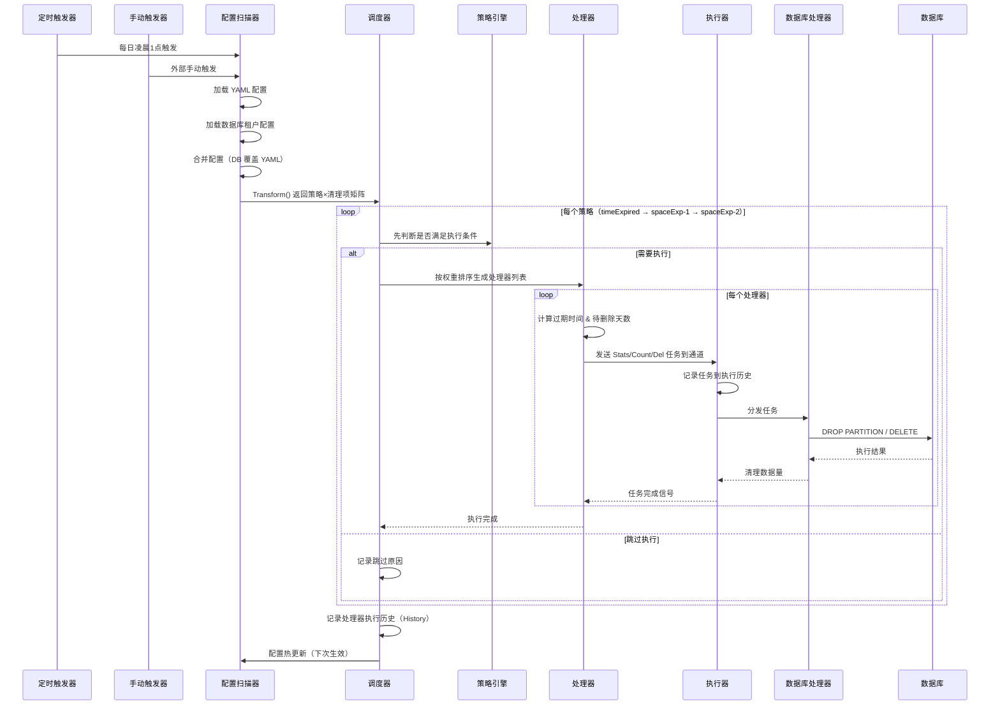
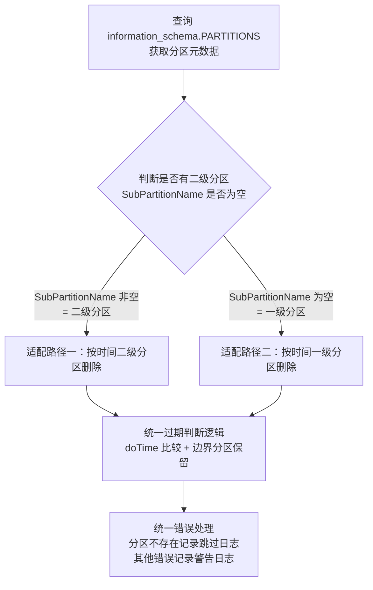
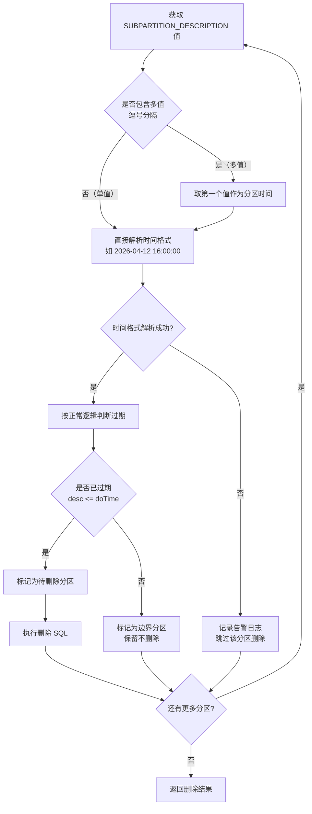
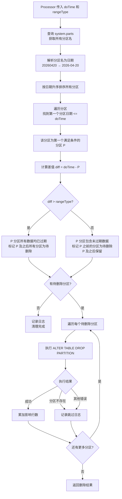
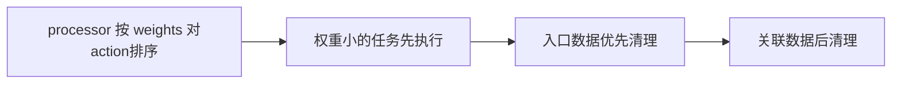
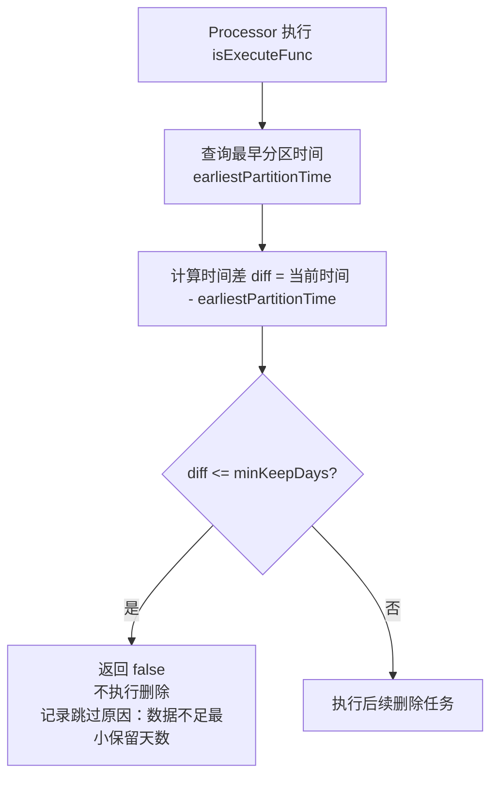
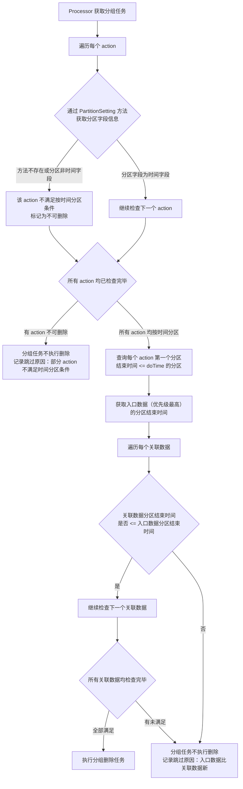

# SFRD-TS-03-1.4 DR2.0 630版本数据生命周期管理模块微型设计说明书

## 目录

- [1. 介绍](#1-介绍)
  - [1.1. 目的](#11-目的)
  - [1.2. 定义和缩写](#12-定义和缩写)
  - [1.3. 参考和引用](#13-参考和引用)
- [2. 模块方案概述](#2-模块方案概述)
  - [2.1. 范围界定](#21-范围界定)
  - [2.2. 方案选型](#22-方案选型)
  - [2.3. XDR数据清理方案](#23-xdr数据清理方案)
    - [2.3.1. 任务配置文件](#231-任务配置文件)
    - [2.3.2. 数据流](#232-数据流)
    - [2.3.3. 组件协作关系](#233-组件协作关系)
  - [2.4. 核心设计模式](#24-核心设计模式)
  - [2.5. AES SaaS 实现方案与 XDR 的区别](#25-aes-saas-实现方案与-xdr-的区别)
    - [2.5.1. 框架层实现差异](#251-框架层实现差异)
- [3. 模块详细设计](#3-模块详细设计)
  - [3.1. 项目目录结构](#31-项目目录结构)
  - [3.2. 配置文件结构](#32-配置文件结构)
    - [3.2.1. 任务配置文件 task.yaml](#321-任务配置文件-taskyaml)
    - [3.2.2. 参数设置配置文件 setting.yaml](#322-参数设置配置文件-settingyaml)
  - [3.3. 核心组件设计](#33-核心组件设计)
    - [3.3.1. Handler（数据库物理清理处理器）](#331-handler数据库物理清理处理器)
      - [3.3.1.1. 过期数据删除](#3311-过期数据删除)
      - [3.3.1.2. 过期分区删除流程](#3312-过期分区删除流程)
    - [3.3.2. CPU 使用率控制](#332-cpu-使用率控制)
    - [3.3.3. 清理优先级控制](#333-清理优先级控制)
    - [3.3.4. 兜底机制](#334-兜底机制)
    - [3.3.5. 线下适配补充](#335-线下适配补充)
  - [3.4. 可靠性保障](#34-可靠性保障)
  - [3.5. 可测试性设计](#35-可测试性设计)
  - [3.6. 可扩展性设计](#36-可扩展性设计)
  - [3.7. 国际化](#37-国际化)
- [4. 关联分析](#4-关联分析)
  - [4.1. 线下aes关联说明](#41-线下aes关联说明)
- [5. 变更控制](#5-变更控制)
  - [5.1. 变更列表](#51-变更列表)
- [6. 附录](#6-附录)
  - [A. 技术指标](#a-技术指标)
  - [B. 核心模块职责](#b-核心模块职责)
  - [C. 任务配置字段说明](#c-任务配置字段说明)
- [7. 修订记录](#7-修订记录)

---

## 1. 介绍

### 1.1. 目的

本设计文档描述XDR 数据清理方案以及AES 平台数据生命周期管理模块的适配方案，用于指导开发工程师完成 630 版本的 线上数据清理功能开发以及后续线下适配参考。

**背景**：不同地区、不同租户对数据（主要是日志类数据）的合规存储周期有差异化要求。当前平台缺乏统一的、可配置的生命周期管理机制，导致存储成本不可控、合规风险提升。

**客户痛点**：

1. **存储成本不可控**：历史数据持续累积，无自动清理机制
2. **合规风险**：不同地区/租户保留周期要求不同，手动管理困难
3. **性能下降**：单表数据量增大，查询性能劣化
4. **关联数据一致性**：清理时可能破坏 CG/告警/事件的关联关系

**业务目标**：

- 能力A：按业务价值定义数据保留时间（30-365天可配置）
- 能力B：按物理存储容量（如 2TB 固定配额）进行 FIFO 自动清理（分布式）

### 1.2. 定义和缩写

| 术语/缩写 | 说明 |
|-----------|------|
| timeExpired | 时间淘汰策略，按保留天数清理过期数据（仅 SaaS 使用） |
| spaceExpired-1 | 一级空间淘汰，磁盘超阈值时优先清理已过期数据（Local 模式使用） |
| spaceExpired-2 | 二级空间淘汰，磁盘超阈值时按权重清理所有数据（Local 模式使用） |
| Scanner | 配置扫描器，从 YAML 加载清理策略配置 |
| Strategy | 清理策略引擎 |
| Processor | 任务处理器，将策略转换为具体清理任务 |
| Executor | 任务执行器，从队列消费任务并调用 Handler |
| Handler | 数据库清理处理器实现（OceanBase/ClickHouse） |
| stats | handler方法，获取最早的分区以及距离当天的天数 |
| count | handler方法，获取某天的数据量 |
| del | handler方法，删除数据 |

### 1.3. 参考和引用

- XDR ROM 源码：http://code.sangfor.org/xdr-business/APEX-Base/module/rom
- XDR数据清理方案：https://wiki.sangfor.com/pages/viewpage.action?pageId=54002730
- xdr数据清理页面: https://10.65.143.149:8443/#/
- 关于数据生命周期需求的梳理：https://aisecops.atrust.sangfor.com/t/topic/11173/2

---

## 2. 模块方案概述

### 2.1. 范围界定

| 维度 | 范围 |
|------|------|
| 支持数据库 | OceanBase、ClickHouse |
| 部署模式 | SaaS 多租户、Local 单租户 |
| 630 版本 | 仅支持 SaaS |
| 不支持 | Cassandra、冷热分级存储、租户维度 |

### 2.2. 方案选型

- SaaS 模式：完全AI自主开发，复用 XDR ROM 框架设计思路（不直接复制代码）
- Local 模式：不开发，提需求给 XDR 团队

| 对比项 | 自研（推荐） | 嵌入 XDR ROM 源码 |
|--------|-------------|-------------------|
| 复杂度 | 中等 | 低 |
| 代码可控性 | 高 | 低（依赖 XDR 仓库） |
| 维护成本 | 低 | 高（版本同步） |
| 架构匹配 | 与 AES 架构一致 | 需要适配层 |
| 结论 | **推荐** | 不推荐 |

**设计决策**：在 AES 中自主实现数据生命周期管理模块，复用 XDR ROM 的架构设计思路（Scanner-策略-处理器-执行器-Handler 模式），而非直接嵌入 XDR 源码，所有规范以aes为准。

### 2.3. XDR数据清理方案

#### 2.3.1.任务配置文件

```yaml
tasks:
  - group: "dataclean.task.name.SecurityEvent"
    name: "dataclean.task.name.SecurityEvent"
    keep:
      min: 7
      max: 365
      default: 180
    actions:
      - weights: 80                         # 权重
        handler: "mongo"                    # 清理插件类型
        handlerArgs:                        # 清理插件参数
        field: "updateTime"                 # 清理时的字段名
        db: "xdr_tenant01_incident"         # 清理时的数据库名
        table: "t_incident"                 # 清理时的数据表名
        expiredMaxNums: 3                   # 清理操作触发时，最多删除多少天数据
        expiredBatchSize: 3                 # 每批清理多少天的数据
        resource: "mongo"                   # 数据源名称，必须与数据源对应
        excludeStrategy:                    # 当前清理项不使用哪些策略，对应的策略触发清理时，会忽略掉该清理项
          - "spaceExpired-2"
      - weights: 70
        handler: "mongo"
        handlerArgs:
        field: "insertTime"
        db: "xdr_tenant01_incident"
        table: "t_attack_story"
        expiredMaxNums: 3
        expiredBatchSize: 3
        resource: "mongo"
        excludeStrategy:
          - "spaceExpired-2"
  # 数据湖安全日志
  - group: "dataclean.task.name.securityLog"
    name: "dataclean.task.name.securityLog.NetworkSecurityLog"
    keep:
      min: 7
      max: 365
      default: 365
    actions:
      - weights: 40
        handler: "clickhouse"
        handlerArgs:
        db: "business"
        table: "network_security_log"
        field: "recordTimestamp"
        resource: "clickhouse"
```

#### 2.3.2.数据流



#### 2.3.3 组件协作关系

```
Scanner
  └─ scanner (实现)
       └─ ScannerAdapter
            ├─ defaultScannerAdapter (本地 YAML)
            └─ cmScannerAdapter (本地配置中心 + 数据库自定义配置读取)

Strategy
  ├─ timeExpiredStrategy (时间过期: IsExecute = isKeep)
  └─ spaceExpiredStrategy (空间过期: 依赖 DiskInfoLoader)

Processor
  └─ processor (default 类型，所有策略共用同一实现)

Task
  ├─ task (基础任务)
  ├─ dbCountTask (实现 DBCountTask 接口) -- 统计该天数据量
  ├─ dbStatsTask (实现 DBStatsTask 接口) -- 查询最早数据时间
  └─ dbDelTask (实现 DBDelTask 接口) -- 删除该天数据（已过期才删除）

Executor
  └─ executor (接收 Task，通过 HandlerManager 分发)
       └─ history.History[Task] (执行历史)

Handler (Handler Manager 统一管理)
  ├─ ClickHouseHandler

Scheduler (顶层编排器)
  └─ 协调 Scanner → Strategy → Processor → Executor → Handler 完整流程
```

### 2.4. 核心设计模式

| 模式 | 应用场景 | 说明 |
|------|----------|------|
| 工厂模式 | Handler/Processor/Strategy | 通过 Register 注册，工厂创建 |
| 策略模式 | 三级淘汰策略 | Strategy 接口抽象不同策略 |
| 责任链模式 | 任务分发 | Scanner → Strategy → Processor → Executor → Handler |
| 事件驱动 | 异步执行 | 通过 channel 实现组件间通信 |


### 2.5. AES SaaS 实现方案与 XDR 的区别

#### 2.5.1. 框架层实现差异

| 组件 | XDR ROM 方案 | AES SaaS 实现方案 | 说明                      |
|------|-------------|------------------|-------------------------|
| 配置扫描器 | 支持 YAML + 数据库双配置源 | 仅支持 YAML | 后续如需要支持多租户再扩展支持         |
| 调度器 | 编排整体工作流 | 编排整体工作流 | 保持一致 |
| 策略引擎 | 三级策略（time/spaceExp-1/spaceExp-2） | 仅 timeExpired | 仅支持时间淘汰策略               |
| 处理器 | 生成task传入outputCh，然后等待，executor负责消费 | task按业务分组，处理器遍历处理业务分组中的action列表，生成task，传入outputCh，然后等待，executor负责消费 | action按优先级排序，入口数据优先级最高，如果失败，其他的关联任务也不再执行 |
| 执行器 | 异步接收任务，然后分发到数据库处理器执行，并记录历史记录 | 异步接收任务，然后分发到数据库处理器执行，不记录历史记录 |   AES 暂不记录清理执行历史到数据库              |
| 数据库处理器 | OB / CK / MongoDB / ES / PostgreSQL | OB / CK | 630 版本仅支持 OB 和 CK       |


---

## 3. 模块详细设计

### 3.1. 项目目录结构
```
aes-mgr/apps/aes-lifecycle-manager/
├── config/
│   ├── task.yaml                        # 任务配置文件
│   └── setting.yaml                     # 参数设置配置文件
├── internal/
│   ├── cmd/
│   │   └── cmd.go                       # 启动命令
│   │── types/                           # 抽象接口目录
│   │   ├── scheduler.go                 # 调度服务（核心编排）
│   │   ├── scanner.go                   # 配置扫描器
│   │   ├── strategy.go                  # 策略引擎
│   │   ├── processor.go                 # 处理器
│   │   ├── executor.go                  # 执行器
│   │   ├── history.go                   # 执行历史
│   │   ├── handler.go                   # Handler
│   │   └── task.go                      # 执行任务
│   ├── service/                         # 抽象接口实现
│   │   └── scheduler/                   
│   │       └── scheduler.go             # 调度服务（核心编排）
│   │   └── scanner/                   
│   │       └── scanner.go               # 配置扫描器
│   │   └── strategy/                   
│   │       └── timestrategy.go          # 时间淘汰策略引擎
│   │   └── processor/                   
│   │       └── processor.go             # 处理器
│   │   └── executor/                   
│   │       └── executor.go              # 执行器
│   │   └── history/                   
│   │       └── history.go               # 执行历史
│   │   └── handler/  
│   │       ├── oceanbase.go             # OceanBase Handler
│   │       └── clickhouse.go            # ClickHouse Handler
│   │   └── task/  
│   │       └── DBDelPartitionTask.go    # 删除过期分区任务
│   │       └── DBStatusTask.go          # 查询最早数据时间分区
│   │       └── DBCountTask.go           # 统计数据量
│   ├── model/
│   │   └── lifecycle.go                 # 数据模型
│   └── lib/                             # 第三方库                   
├── manifest/
│   └── helm/
│       ├── Chart.yaml
│       ├── values.yaml
│       ├── config/
│       │   ├── config.dev.yaml
│       │   └── config.prod.yaml
│       └── templates/
│           ├── configmap.yaml
│           ├── cmtask.yaml
│           ├── deployment.yaml
│           └── service.yaml
├── main.go                              # 服务入口
├── go.mod
├── Makefile
└── README.md
```

### 3.2. 配置文件结构

### 3.2.1. 任务配置文件 task.yaml
对比xdr数据清理方案，因为aes saas是drop分区的方式，所以这里不需要expiredMaxNums和expiredBatchSize，每次清理分区的时候将删除过期的分区即可
```yaml
# 清理任务配置
tasks:
  - group: "dataclean.task.name.AlertLog" # 业务分组
    name: "dataclean.task.name.AlertLog"
    keep:                                 # 保留天数
      min: 7
      max: 365
      default: 180
    actions:
    # ===== OceanBase 任务 =====
        handler: "oceanBase"        # 清理插件类型
        handlerArgs:                # 清理插件参数
        db: "aes_console"           # 清理时的数据库名
        table: "data_alert_log"     # 清理时的数据表名
        field: "create_at"          # 清理时的字段名
        resource: "oceanBase"       # 数据源名称，必须与数据源对应
        rangeType: "week"           # 分区时间范围，day、week、month
  - group: "dataclean.task.name.Detection"
    name: "dataclean.task.name.Detection"
    keep:
      min: 7
      max: 365
      default: 180
      actions:
        handler: "oceanBase"
        handlerArgs:
        db: "aes_console"
        table: "data_detection"
        field: "create_at"
        resource: "oceanBase"
        rangeType: "month"
  - group: "dataclean.task.name.Incident"
    name: "dataclean.task.name.Incident"
    keep:
      min: 7
      max: 365
      default: 180
    actions:
        handler: "oceanBase"
        handlerArgs:
        db: "aes_console"
        table: "data_incident"
        field: "create_at"
        resource: "oceanBase"
        rangeType: "week"
  - group: "dataclean.task.name.GptRes"
    name: "dataclean.task.name.GptRes"
    keep:
      min: 7
      max: 365
      default: 180
    actions:
        handler: "oceanBase"
        handlerArgs:
        db: "aes_console"
        table: "data_gpt_res"
        field: "create_at"
        resource: "oceanBase"
        rangeType: "month"
  - group: "dataclean.task.name.GptRes"
    name: "dataclean.task.name.GptRes"
    keep:
      min: 7
      max: 365
      default: 180
    actions:
  # ===== ClickHouse =====
        handler: "clickhouse"
        handlerArgs:
        db: "business"
        table: "data_alert_cg_telemetry_log"
        field: "insertTime"
        resource: "oceanBase"
        rangeType: "day"

```

### 3.2.2. 参数设置配置文件 setting.yaml
```yaml
log:
  appName: "aes-lifecycle-manager"
  level: "INFO"
  output:
    - console

# 调度配置
scheduler:
  executorNums: 1 #并发执行数
  executeProcessorInterval: 10   # processor执行间隔10秒

# 兜底配置
safeguard:
  minKeepDays: 90  # 最小保留天数，防止数据被清理完，和授权天数保持一致
  
# 策略引擎配置（仅 timeExpired），expiredMaxNums和expiredBatchSize是引擎层面的设置，如果action层面也可以配置该值，会覆盖这里的配置
strategy:
  - name: timeExpired
    type: timeExpired
    expiredMaxNums: 3        # 单次最多清理 3 天
    expiredBatchSize: 3      # 每批清理 3 天

database:  # 数据源配置
  ob:  # OceanBase 数据源
    - instanceName: "oceanBase"
      type: "oceanBase"
      username: "root@test"        # 格式：主用户@子用户
      password: "password"
      address: "10.74.185.110"
      port: 32883
      dbName: "test"
      driver: "mysql"
      config: "sslmode=disable"
      enableMetric: true
      enableTrace: true
      connTimeout: 60
  ck:  # # ck默认连接第一个分片，不使用proxy
    - instanceName: "clickhouse"
      address: 10.74.185.110
      port: 30202
      dbName: tenant_group_name
      driver: "clickhouse"
      username: operator
      password: sangfor
      config: "sslmode=disable"
      enableMetric: true
      enableTrace: true
      connTimeout: 60
```

### 3.3. 核心组件设计

#### 3.3.1. Handler（数据库物理清理处理器）

**职责**：各数据库物理清理实现，通过统一的工厂函数创建 Handler 实例，封装 OceanBase 和 ClickHouse 的分区操作差异。

##### 3.3.1.1. 过期数据删除

**核心概念**：通过配置指定数据的保留天数（keep）和分区粒度（rangeType），系统自动计算过期时间阈值，查询数据库分区元数据，筛选出已过期的分区，执行物理删除。

**删除对象**：

| 数据库 | 分区结构 | 删除方式 |
|--------|---------|---------|
| OceanBase | 两级分区（KEY 一级 + RANGE 二级） | `ALTER TABLE ... MODIFY PARTITION ... DROP SUBPARTITION ...` |
| ClickHouse | 单层分区 | `ALTER TABLE ... DROP PARTITION ...` |

**关键配置字段**：

- `keep`：数据保留天数（最小保留天数受兜底机制约束）
- `rangeType`：分区时间粒度（day / week / month），决定ck过期时间的计算方式

##### 3.3.1.2. 过期分区删除流程

**过期判断逻辑**：

- `doTime = 当前时间 - keep 天`（由 Processor 计算）
- 只删除**严格小于 doTime** 的分区
- **边界分区（分区时间刚好在 doTime 附近）需要保留**，因为该分区可能同时包含过期和非过期数据

**OceanBase 多分区方式适配设计**：

OceanBase 表可能采用以下两种分区结构，Handler 代码层通过统一的逻辑适配，无需为每种分区方式编写独立代码：

| 分区方式 | 一级分区 | 二级分区 | 删除 SQL |
|---------|---------|---------|---------|
| 按时间二级分区（线上标准方式） | KEY（租户/业务维度） | RANGE COLUMNS（时间） | `ALTER TABLE ... MODIFY PARTITION 一级分区名 DROP SUBPARTITION 二级分区名` |
| 按时间一级分区（线下方式） | RANGE COLUMNS（时间） | 无 | `ALTER TABLE ... DROP PARTITION 分区名` |

**代码层适配策略**：

Handler 在执行删除前，先查询 `information_schema.PARTITIONS` 获取分区元数据，根据元数据特征自动判断分区方式，走统一适配逻辑：



**关键适配点说明**：

1. **统一查询接口**：查询 `information_schema.PARTITIONS` 时同时返回 `PARTITION_NAME` 和 `SUBPARTITION_NAME`，代码层判断 `SUBPARTITION_NAME` 是否为空来决定删除路径
2. **统一过期判断逻辑**：无论是一级分区还是二级分区，过期判断逻辑（doTime 比较、边界分区保留）保持一致
3. **统一 SQL 构造**：一级分区使用 `DROP PARTITION`，二级分区使用 `MODIFY PARTITION ... DROP SUBPARTITION`，在代码层通过分支构造
4. **统一错误处理**：分区不存在、分区已被删除等错误统一记录跳过日志，不影响其他分区删除

**OceanBase 过期分区获取与删除流程**：

**查询分区信息的 SQL（OB）**：

```sql
SELECT TABLE_SCHEMA, TABLE_NAME, PARTITION_NAME, SUBPARTITION_NAME,
       COALESCE(SUBPARTITION_DESCRIPTION, '') as SUBPARTITION_DESCRIPTION
FROM information_schema.PARTITIONS
WHERE TABLE_SCHEMA = DATABASE() AND TABLE_NAME = ?
ORDER BY PARTITION_ORDINAL_POSITION, SUBPARTITION_ORDINAL_POSITION
```

**OceanBase 实际分区数据示例**（`information_schema.PARTITIONS` 查询结果）：

```
PARTITION_NAME | SUBPARTITION_NAME | SUBPARTITION_METHOD | SUBPARTITION_DESCRIPTION
---------------|-------------------|--------------------|--------------------------
p0             | p0ssp_0           | RANGE COLUMNS      | '2026-04-12 16:00:00'
p0             | p0ssp_1           | RANGE COLUMNS      | '2026-04-19 16:00:00'
p0             | p0ssp_2           | RANGE COLUMNS      | '2026-04-26 16:00:00'
p1             | p1ssp_0           | RANGE COLUMNS      | '2026-04-12 16:00:00'
p1             | p1ssp_1           | RANGE COLUMNS      | '2026-04-19 16:00:00'
```

**SUBPARTITION_DESCRIPTION 字段解析与多值处理**：

`SUBPARTITION_DESCRIPTION` 字段存储分区结束时间，但当子分区按多字段（复合）分区时，该字段中会包含多个值（以逗号分隔），此时无法直接解析为单一时间。

**解析策略**：

1. **单值场景**：直接解析为时间格式（如 `2026-04-12 16:00:00`），按正常逻辑判断过期
2. **多值场景（复合分区）**：取第一个值作为分区标识时间进行解析；如果时间格式解析失败，记录**告警日志**，该分区跳过删除并标记为"无法解析"
3. **解析失败告警日志格式**：

```
[WARN] SUBPARTITION_DESCRIPTION parse failed, table={tableName}, partition={partitionName},
subPartition={subPartitionName}, value={subPartitionDesc}, reason=multi-field or invalid format, skip deletion
```

**解析流程图**：



**ClickHouse 过期分区获取与删除流程**：

**说明**：

- CK 按天分区，某天无数据则不会创建分区
- `rangeType` 用于计算过期边界，不用于解析分区名格式
- 边界分区逻辑与 OB 一致：找到第一个分区日期 > doTime，删除该分区之前的所有分区

**CK 分区查询 SQL**：

```sql
SELECT DISTINCT partition
FROM system.parts
WHERE `table` = 'data_cg_telemetry_log_local'
```

**CK 实际分区数据示例（按天分区）**：

```
partition
20260420
20260411
20260412
20260413
20260414
20260415
20260416
20260417
20260319
20260409
```

**ClickHouse 过期分区删除流程**：



**计算示例**：

假设 `doTime = 2026-04-20`，`rangeType = week`：

| 分区日期 | 分区日期 <= doTime? | diff (天) | diff > rangeType? | 删除? |
|---------|---------------------|-----------|-------------------|-------|
| 2026-04-14 | 是 | 6 | 否（6天<1周） | 否，保留 |
| 2026-04-06 | 是 | 14 | 是 | 是 |
| 2026-03-30 | 是 | 21 | 是 | 是 |

- 第一个满足条件的分区 P = 2026-04-14
- diff = 7天 = 1周 = rangeType
- 因为 diff <= rangeType，**P (2026-04-14) 及之后的分区保留**，**P 之前的分区（2026-04-06 等）需要删除**

##### 3.3.2. CPU 使用率控制

**控制方式**：通过数据库子用户控制 CPU 资源占用。

**原理**：在配置文件中为数据库连接创建子用户，不同子用户可配置不同的 CPU 资源配额，从而控制清理任务的资源消耗。

**配置示例**（参考 `aes-migration/config/config.yaml`）：和曹臻确认，630会支持，这里补充说明配置方法

```yaml
database:
  - instanceName: "default"
    dir: "./apps/migrations/database/mysql/"
    users:
      - user: "readonly"
        pass: "NbXwFCI@"
        perm: "r"
    # 子用户可通过数据库配置控制 CPU 配额
```

**子用户 CPU 控制机制**：

- OceanBase：创建子用户时指定资源限制（如 `CREATE USER ... WITH ...`），限制 CPU 使用比例
- ClickHouse：可通过子用户配置查询并发数和内存限制，但是无法控制cpu使用比例

##### 3.3.3. 清理优先级控制

**控制方式**：处理器会根据action分组执行，action通过配置文件中的 `weights` 字段控制清理优先级，如果某个action执行失败了，则和该业务组关联的action都不会再执行

**设计原则**：权重值越小，优先级越高，优先执行清理。入口数据权重最小，优先删除；关联数据权重较大，后删除。

**优先级执行流程**：


**执行顺序保证**：Processor 在生成任务时按 `weights` 升序排列，Scheduler 依次执行，确保关联数据在入口数据清理完成后才执行。

当前项目中需要清理的数据都会多保留30d，不会影响到页面数据展示，所以暂时不需要考虑优先级，直接删除即可

##### 3.3.4. 兜底机制

**目的**：防止因代码 bug 导致所有数据被误删，提供数据保护机制。

**机制一：最小保留天数（minKeepDays）**

`minKeepDays` 是全局常量，从配置文件的 `safeguard.minKeepDays` 读取，默认值为最小值授权时长天数。

强制约束所有清理任务的最小保留天数，即使配置了较短的 `keep` 值，实际清理时也不会删除 `minKeepDays` 以内的数据；minKeepDays要大于等于授权时长

**配置示例**：

```yaml
safeguard:
  minKeepDays: 90  # 默认值，最小保留天数
```

**兜底判断逻辑**：

通过 Processor 的 `isExecuteFunc` 执行判断函数，在执行清理前进行兜底校验：



**约束关系**：

```
页面可查询天数（授权时长） < minKeepDays < keep
```

##### 3.3.5. 线下适配补充

**场景说明**：线下不会按租户进行一级分区，只按时间进行分区。

**线下环境删除 SQL**：

```sql
-- 直接删除按时间命名的一级分区
ALTER TABLE data_detection DROP PARTITION p20260412
```

##### 3.3.6. 分组任务执行前可删除性预检

**目的**：执行分组任务时，由 **Processor** 执行预检，判断该分组内**所有 action 关联的表是否均满足可删除条件**，只有全部可删除时才执行删除逻辑，避免关联数据已删除但入口数据未删除导致页面数据查看丢失。

**预检时机**：Processor 在生成删除任务之前执行预检。

**预检判断逻辑**：

预检需要同时满足以下两个条件，才认为该分组任务**可执行删除**：

**条件一：所有 action 是否均按时间字段分区**

通过 `aes-go-module-util/model` 中数据表对应的结构体提供的 `PartitionSetting()` 方法，获取每个表的分区字段信息。如果存在 action 未实现该方法或分区字段非时间字段，则该分组任务**不执行删除**。

**条件二：入口数据与关联数据的分区时间比较**

对于业务组内每个 action，根据 doTime 查询该表第一个分区结束时间 <= doTime 的分区（即该分区已完全过期，可以删除）。然后比较业务组内**优先级最高的入口数据**与**其他关联数据**的分区时间：

- 如果入口数据的分区结束时间 >= 所有关联数据的分区结束时间 → 可以删除
- 如果入口数据的分区结束时间 < 任一关联数据的分区结束时间 → 不执行删除

**典型场景说明**：

假设业务组包含 action1（入口数据，按周分区）和 action2（关联数据，按天分区），`doTime = 2026-04-10`：

| action | 角色 | rangeType | 第一个分区结束时间 <= doTime | 说明 |
|--------|------|-----------|---------------------------|------|
| action1 | 入口数据 | week | 2026-04-05（03-30~04-05 周分区已完全过期） | 可以删除 |
| action2 | 关联数据 | day | 2026-04-09（04-09 日分区已完全过期） | 可以删除 |
| **比较结果** | - | - | 04-05 >= 04-09？否 | **不执行删除** |

**不执行原因**：入口数据（action1）分区结束时间为 04-05，关联数据（action2）分区结束时间为 04-09，04-05 < 04-09，入口数据比关联数据更新，此时执行删除会导致关联数据被删但入口数据未删，页面数据查看丢失。

假设 action2 的第一个可删除分区结束时间为 `2026-04-05`（04-05 日分区已完全过期）：

| action | 角色 | rangeType | 第一个分区结束时间 <= doTime | 说明 |
|--------|------|-----------|---------------------------|------|
| action1 | 入口数据 | week | 2026-04-05（03-30~04-05 周分区已完全过期） | 可以删除 |
| action2 | 关联数据 | day | 2026-04-05（04-05 日分区已完全过期） | 可以删除 |
| **比较结果** | - | - | 04-05 >= 04-05？是 | **执行删除** |

**执行原因**：入口数据（action1）分区结束时间 04-05 >= 关联数据（action2）分区结束时间 04-05，入口数据不比关联数据新，可以安全删除，不会导致页面数据查看丢失。

**预检流程图**：



**兜底说明**：预检不通过时，分组任务直接跳过，不阻塞其他分组任务的执行。

##### 3.4. 可靠性保障

**目的**：确保所有需要清理的数据表都能被正确扫描和处理，防止遗漏。

**流水线配置校验测试（go test）**：

通过 go test 单元测试，检测所有用时间进行分区的表是否位于指定配置文件中。检测方式根据数据库类型分为两种：

- **OceanBase**：通过 AST 反射扫描 `aes-go-module-util/model` 目录，检测 struct 是否实现 `PartitionSetting()` 方法，然后可以获取到设置的分区字段名
- **ClickHouse**：解析 `aes-mgr/apps/aes-migration/apps/migrations/database/clickhouse` 下所有建表SQL文件获取分区字段

**SQL 文件解析方式**：

解析步骤：
1. 读取 `aes-mgr/apps/aes-migration/apps/migrations/database/clickhouse` 目录下所有 `.sql` 文件
2. 使用正则表达式提取 `CREATE TABLE` 中的表名
3. 使用正则表达式提取 `PARTITION BY` 后面的分区表达式
4. 从分区表达式中提取时间字段名（如 `insertTime`）

**白名单机制**：

如果数据表不需要清理任务，可通过白名单配置跳过：

**测试文件位置**：

`aes-mgr/apps/aes-lifecycle-manager/config/task_config_checker_test.go`


##### 3.5. 可测试性设计

**1. Debug 内部测试接口**

**目的**：提供测试手段，触发数据清理，避免只能通过定时任务触发，不方便测试。

提供内部 Debug 接口，用于手动触发清理任务进行测试。接口仅供内部使用，不对外暴露。

**实现方案**（参考 `aes-crontab/api/debug`）：

**接口信息**:
- **方法**: POST
- **路径**: /aes/debug/v1/data-expired-cleanup
- **功能**: 手动触发清理任务，无请求参数和返回参数
- **认证**: AKSK认证


**调用示例**：

```bash
# 手动触发清理任务
curl -X POST http://localhost:8080/aes/debug/v1/data-expired-cleanup \
  -H "License-Algorithm: hmac-sha256" \
  -H "License-Key: your-access-key" \
  -H "License-Nonce: $(uuidgen)" \
  -H "License-Timestamp: $(date +%s)" \
  -H "License-Signature: your-computed-signature" \
  -H "Content-Type: application/json" \
```

**2. 性能测试**

**月分区大量数据删除性能测试**：

| 测试场景 | 测试内容 | 关注指标 |
|---------|---------|---------|
| 单分区删除 | 删除包含大量数据的月分区 | 删除耗时 < 5s |
| 并发删除 | 多个分区同时删除 | CPU/内存占用、删除耗时 |
| 大数据量删除 | 单分区数据量 > 1000万条 | 删除是否成功、是否有超时 |

**性能优化建议**：

- 业务低峰期执行清理，减少对业务的影响

##### 3.6. 可扩展性设计

**目的**：支持未来扩展更多功能，保持架构的灵活性。

**1. 新增 Handler 支持**

通过工厂模式注册新数据库类型Handler，无需修改核心代码。

**2. 新增策略支持**

通过策略模式扩展新清理策略。

**3. 多租户支持**

自定义数据保留天数配置存入数据库，数据库handler新增根据租户删除数据的方法。

**扩展点总结**：

| 扩展点 | 当前实现 | 可扩展方向 |
|--------|---------|-----------|
| Handler | OB / CK | Cassandra |
| 策略 | timeExpired | spaceExpired、customExpired |
| 触发方式 | 定时触发 | 手动触发 |
| 监控指标 | 执行日志 | Prometheus metrics、钉钉/邮件告警 |

##### 3.7. 国际化

线上不涉及

线下页面需要展示管理生命周期的日志配置，后续提需求时要考虑提供中英文给xdr

---

## 4. 关联分析

### 4.1. 线下aes关联说明

线下aes **不需要 AES 开发**，采用以下策略：

1. **提需求给 XDR 团队**：将 AES 的数据库表结构和清理需求提交给 XDR ROM 团队
2. **复用 SaaS 的 Handler 实现**：AES 提供 OceanBase 和 ClickHouse 的 Handler 数据库创建逻辑（建表语句、分区策略等），供 XDR 团队参考
3. **XDR CMP 底座**：Local 模式部署在 XDR CMP 平台中，使用 XDR ROM 内置的清理框架

---

## 5. 变更控制

### 5.1. 变更列表

| 变更章节 | 变更内容 | 变更原因 | 变更对老功能、原有设计的影响 |
|---------|---------|---------|------------------------------|
| - | - | - | - |

---

## 6. 附录

### A. 技术指标

| 指标 | 目标值 | 说明 |
|------|--------|------|

### B. 核心模块职责

| 模块 | 源文件 | 职责 | 关键接口 |
|------|--------|------|----------|

### C. 任务配置字段说明

| 字段 | 类型 | 必填 | 说明 |
|------|------|------|------|

---

## 7. 修订记录

| 修订版本号 | 作者 | 日期 | 简要说明 |
|-----------|-----|------|---------|
